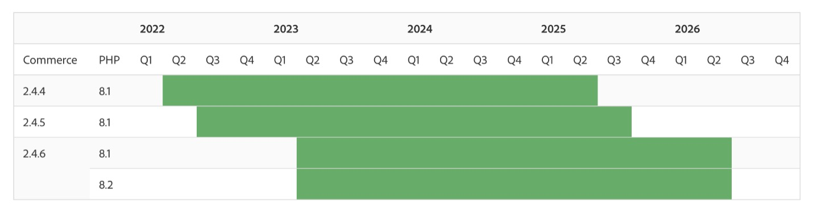

# 2024年和2023年Adobe Commerce發行策略與生命週期政策的常見問題集

## 2024和2023年發行策略及更新的生命週期原則

### Adobe Commerce軟體生命週期政策在2023年和2024年會有何改變？

為了滿足Adobe Commerce客戶的關鍵任務需求，我們將Adobe Commerce 2.4.4及更新版本的支援時段擴大為 **從版本開始3年 [!DNL GA] 日期**. 支援包括 **安全性與品質修補程式**.

### 這些變更將如何使客戶受益？

較長的支援時段可辨識我們的客戶在全球各地經營多個網站時所面臨的複雜性，並讓客戶從每次部署中獲得更多價值。 客戶可以更長時間持續使用新版本，降低總體擁有成本，並釋出資源，專注於新增功能或自訂購買體驗，以加速成長。

### 客戶可以在哪裡找到我們目前的生命週期原則？

此 [Adobe Commerce軟體生命週期原則](https://www.adobe.com/content/dam/cc/en/legal/terms/enterprise/pdfs/Adobe-Commerce-Software-Lifecycle-Policy.pdf) 可線上上取得。

### 根據這項新政策，2.4.4、2.4.5和2.4.6的客戶將於何時終止支援？

Adobe Commerce 2.4.4+的客戶將收到此版本3年的安全性與品質修正 [!DNL GA] 日期，如下表的時間軸所示。 請參閱 [發行版本](https://experienceleague.adobe.com/docs/commerce-operations/release/versions.html) 頁面於 [!DNL Experience League] 以取得特定支援終止日期。

### Adobe Commerce發行排程如何變更？

為了加速創新及降低總體擁有成本，每年將會推出一個核心應用程式修補程式，並提供可撰寫的新功能 [!DNL SaaS] 可隨時新增的服務。 今年計畫發行的安全性修補程式數量也從三增加到四個，以協助客戶維持更安全的狀態。 其他 [!DNL beta] 2024年核心應用程式修補程式發行版本(2.4.7)也將在今年推出，以協助合作夥伴和客戶為下一個版本做好準備。

### 新的發行排程如何讓客戶受益？

以可撰寫的方式提供新功能 [!DNL SaaS] 服務可讓客戶更快速地存取有助於提高銷售的新工具。 您隨時都可運用功能，不必升級核心的Adobe Commerce應用程式。 此外，Adobe可持續更新這些服務，以提供功能和效能的最新進展。 每年發佈一個核心應用程式修補程式，有助於降低升級成本、簡化升級規劃，並提供更多自訂與最佳化商業體驗的時間。 其他輕量型安全性修補程式可協助客戶維持更安全的狀態。

### 什麼是搶鮮版存取？

在2023年，客戶可以在正式發行前約兩週存取Adobe Commerce修補程式版本。

從2024年開始，Adobe不再提供修補程式的「發行前」存取權。 相反地，對於2.4.7和更新版本，客戶可以使用 [Beta版本](https://experienceleague.adobe.com/docs/commerce-operations/release/beta.html) 存取用於測試和開發用途的預先一般可用性程式碼。 下列2023年版本仍會排程搶鮮版存取：

* 2023年8月8日搶鮮版存取時間為2023年7月25日
* 2023年10月10日搶鮮版存取時間為2023年9月26日

### Adobe Commerce發行排程發佈於何處？

檢視 [Adobe Commerce發行排程](https://experienceleague.adobe.com/docs/commerce-operations/release/planning/schedule.html) 於 [!DNL Experience League] 以取得更多詳細資料。

### 排程中包含哪些不同型別的版本？

* **核心應用程式修補程式發行版本**：核心應用程式升級，包含安全性、效能以及高優先順序的品質修正。
* **[!DNL Beta]版本修補程式發行版本**：非[!DNL General Availability] 核心Adobe Commerce應用程式的程式碼更新，包括安全性、法規遵循、效能以及高優先順序的品質修正。 它可讓您在發行修補程式前有更多時間檢閱程式碼和受影響的元件 [!DNL GA].
* **擴充性、基礎結構和服務版本**：與修補程式版本分開發行以組合服務形式提供的新功能和功能更新。 範例包括如下的服務 [!DNL Product Recommendations] 和 [!DNL Live Search]，獨立模組，例如 [!DNL PWA Studio] 和 [!DNL Inventory Management] (MSI)，以及我們的雲端服務和基礎建設的更新。
* **安全性修補程式發行**：發行核心應用程式的僅限安全性更新，確保客戶安全且合規。

### 客戶從哪裡取得高品質的修補程式？

品質修補程式是分發個別品質問題修正程式的方法。 客戶可聯絡Adobe支援或使用 [[!DNL Quality Patch Tool]](https://experienceleague.adobe.com/docs/commerce-knowledge-base/kb/announcements/commerce-announcements/magento-quality-patches-released-new-tool-to-self-serve-quality-patches.html) 以尋找品質的修補程式。

### 有哪些資源可協助進行一般規劃、預算編制和升級？

可用資源包括完整的2.4升級指南、技術升級工作坊錄影及 [!DNL Upgrade Compatibility Tool]. 資源完整清單可在以下網址找到： [Experience League](https://experienceleague.adobe.com/docs/commerce-operations/upgrade-guide/resources/recommended-reading.html).

### 身為Managed Services客戶，客戶工程如何協助我升級至2.4.4+?

Managed Services客戶可與我們的客戶工程團隊合作，以獲得升級程式部分元件的協助，包括分析、升級雲端服務、品質和使用者驗收測試([!DNL QA] 和 [!DNL UAT])，以及生產環境啟動。

## 延伸支援選項

### 針對2.3.7和2.4.0-2.4.3版的客戶是否有延伸支援選項？

雖然我們鼓勵客戶儘快升級，但付費延長支援計畫也提供以下版本的支援： [!DNL PHP] 7.4 （使用2.3.7和2.4.0-2.4.3的客戶）。 這些計畫包含核心應用程式的品質與安全性修補程式，以及 [!DNL PHP] 最多一年。

* 2.3.7的延長支援從2022年9月8日開始，可接收到2023年9月8日。
* 2.4.0至2.4.3的延伸支援已於2022年11月28日開始，並可在2023年11月28日之前接收。

### 延伸支援是否可確保 [!DNL PCI] 合規性？

在長期支援下，我們的客戶工程團隊將繼續提供相同品質和安全的修補程式，而不會降低任何範圍。 但是，客戶需要採取其他措施來留下來 [!DNL PCI] — 相容，如果基礎協力廠商技術，例如 [!DNL MySQL]，連絡支援終止人員。 Adobe不支援已終止支援的協力廠商技術 **除了 [!DNL PHP] 支援的版本 [!DNL PHP] 由符合支援服務或延伸支援資格的Adobe Commerce版本使用**. Adobe建議客戶搭配其 [PCI評估程式](https://www.pcisecuritystandards.org/assessors_and_solutions/qualified_security_assessors) 以確保法規遵循。 請參閱 [Adobe Commerce系統需求](https://experienceleague.adobe.com/docs/commerce-operations/installation-guide/system-requirements.html) 以取得經過測試和支援的協力廠商技術完整清單。

