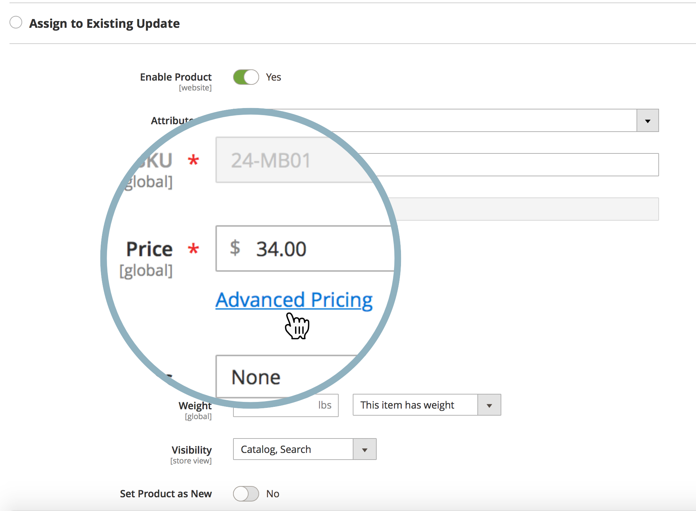

# 我可以針對共用目錄中的價格排程內容測試更新嗎？

Adobe Commerce不提供為共用目錄中的一或多個產品排程價格更新([Content Staging](https://experienceleague.adobe.com/docs/commerce-admin/content-design/staging/content-staging.html))的功能。

這表示您無法直接從Commerce管理面板的&#x200B;**設定價格與結構**&#x200B;功能表排程此價格更新（此功能表中沒有&#x200B;**排程新更新**&#x200B;按鈕）。

不過，您仍可使用其他方法，並針對下列專案排程價格更新：

* 客戶群組
* 產品基本價格

## 客戶群組的排程價格更新

1. 開始[排程新產品更新](https://experienceleague.adobe.com/docs/commerce-admin/content-design/staging/content-staging-scheduled-update.html)。
1. 向下捲動至&#x200B;**價格**&#x200B;欄位，然後按一下&#x200B;**進階價格**。

   {width="600"}

1. 在&#x200B;**客戶群組價格區段**&#x200B;中，選取所需的客戶群組並設定更新的價格。

   {width="700"}

1. 照常完成排程更新。

在此工作流程中，您只能更新單一產品的價格；無法使用大量價格更新。

請記住：共用目錄會運用客戶群組定價。

**相關檔案**

* [正在排程我們的使用手冊中的更新（內容暫存）](https://experienceleague.adobe.com/docs/commerce-admin/content-design/staging/content-staging-scheduled-update.html)。
* 使用手冊中的[進階價格](https://experienceleague.adobe.com/docs/commerce-admin/catalog/products/pricing/pricing-advanced.html)。

## 基準價格的排程價格更新

請參閱相關文章： [基本價格變更如何影響共用目錄價格？我們的支援知識庫中的](/help/faq/general/base-price-change-affect-on-shared-catalog-price.md)。
