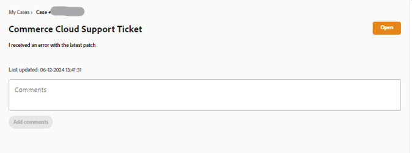
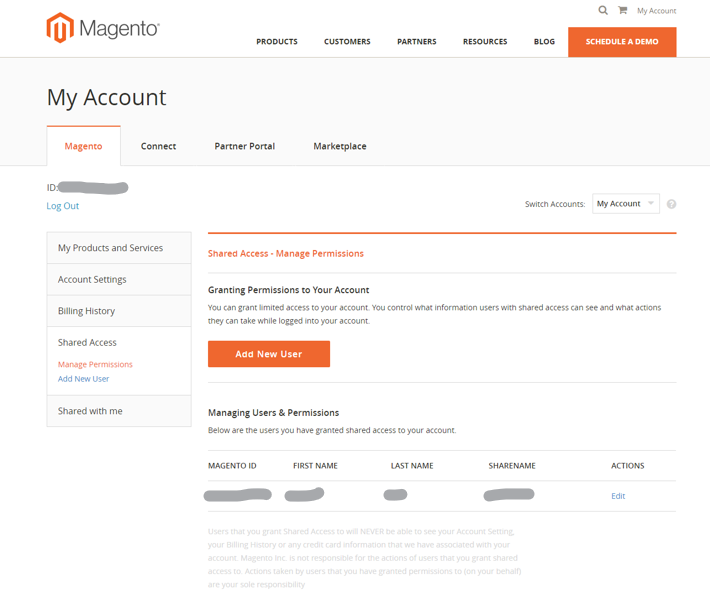
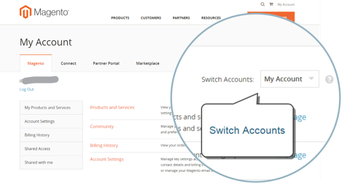

# Adobe Commerce的Experience League支援使用指南

在本指南中，瞭解如何向[Experience League支援](https://experienceleague.adobe.com/home#support)提交支援票證，以及提供Adobe Commerce帳戶的共用存取權。

>[!NOTE]
>
>Adobe Commerce支援已從Adobe Commerce說明中心移轉至Experience League。 使用[這裡](#what-is-experience-support)描述的Experience League案例表單流程來提交支援案例。

>[!NOTE]
>
>目前，若要在Adobe Commerce說明中心檢視您先前提交的案例，您必須前往https://support.magento.com/hc/en-us/requests，因為這些案例尚未移轉至新的支援票證系統。 說明中心現在是唯讀的；若要繼續收到原始問題的支援，您必須向[Experience League支援](https://experienceleague.adobe.com/home#support)提交後續支援票證。

>[!NOTE]
>
>Adobe Commerce說明中心的知識庫部分已移轉至Adobe Experience League入口網站。 建立支援票證時，會向您建議相關知識庫文章，以及Adobe Experience League的其他相關Adobe Commerce檔案。

**重大更新：** 2024年7月29日

**[什麼是EXPERIENCE LEAGUE支援？](#what-is-experience-support)**

**[支援案例](#support-cases)**

* [登入Experience League支援](#sign-in-experience-support)
* [提交支援案例](#submit-case)

   * [Adobe Experience League起始頁面](#experience-league-start-page)
   * [Adobe Commerce帳戶頁面](#submit-case-adobe-commerce-account-page)
   * [*請確認您的電子郵件地址*](#verify-email-address-error)

* [追蹤您的支援案例](#track-support-cases)
* [您案例中的註解](#comments-in-your-case)
* [關閉您的案例](#close-case)
* [重新開啟您的案例](#reopen-case)
* [使用Cloud Console提交票證](#cloud-console)
* [Adobe Commerce P1熱線](#P1-hotline)
* [Adobe Commerce分擔責任運作模式](#shared-responsibility-operational-model)

**[共用存取權：授予其他使用者存取您帳戶的許可權](#shared-access)**

* [誰可以提供共用存取權](#who-can-provide-shared-access)
* [提供共用存取權](#provide-shared-access)
* [撤銷（刪除）共用存取權](#revoke-shared-access)

   * [如何刪除透過雲端專案獲得共用存取許可權的使用者？](#remove-cloud-shared-access-users)

* [存取共用帳戶（切換帳戶）](#switch-accounts)
* [共用存取疑難排解](#troubleshooting-shared-access)

**[ADOBE COMMERCE的計費常見問題集](#billing-faq)**

## 什麼是EXPERIENCE LEAGUE支援？ {#what-is-experience-support}

Experience League支援是Adobe的支援入口網站，符合資格的Adobe Commerce客戶可以在這裡提交和管理支援票證。 您也可以在此處檢閱疑難排解文章。

## 支援案例 {#support-cases}

Adobe Experience League支援案例管理可透過案例與支援人員合作，解決在合約規定的所有Adobe Commerce產品使用Adobe產品(包括Adobe Commerce)時遇到的特定問題。

## 登入EXPERIENCE LEAGUE支援 {#sign-in-experience-support}

登入可讓您提交、更新及回應代理程式有關支援票證的問題。

若要登入Adobe Experience League支援，請依照下列步驟操作：

1. 導覽至[experienceleague.adobe.com](https://experienceleague.adobe.com/)。
1. 使用您的Adobe登入憑證登入。

### 提交支援案例 {#support-case}

以帳戶擁有者或「共用存取權」使用者的身分成功登入後，您可以使用Adobe Experience League首頁、Adobe Commerce帳戶頁面和Adobe Commerce Cloud帳戶頁面來提交支援案例。

* 如果您是帳戶擁有者或回訪的「共用存取權」使用者，請遵循下列步驟。
* 如果您是「共用存取權」使用者，而帳戶擁有者剛剛[提供您共用存取權](https://experienceleague.adobe.com/en/docs/commerce-knowledge-base/kb/help-center-guide/magento-help-center-user-guide#provide-shared-access)，您必須先切換帳戶，才能繼續下列步驟。 如需詳細資訊，請參閱[存取共用帳戶（切換帳戶）](https://experienceleague.adobe.com/en/docs/commerce-knowledge-base/kb/help-center-guide/magento-help-center-user-guide#switch-accounts)。

#### Adobe Experience League起始頁面 {#experience-league-start-page}

若要使用Adobe Experience League起始頁面提交新的支援案例，請遵循下列步驟：

>[!INFO]
>
>1. 若要提交案例，您必須有權獲得適當產品的支援(例如Adobe Commerce、Adobe Commerce Intelligence、Experience Platform等)。 如果您無權取得支援，頁面頂端會顯示橫條，通知您您您並非組織中有權取得支援的使用者。
>1. 如果您隸屬於多個組織，或有多個名稱相似的組織(每個組織都代表該組織訂閱的任何其他Adobe產品)，您必須先從下拉式清單中選取適當的組織。

>[!NOTE]
>
>在提交案例之前，請確保您已選取正確的組織，並且您選取的組織對於您請求支援的產品具有適當的權益。 例如，如果您的問題與Adobe Commerce有關，但您選擇Experience Platform作為產品，並且案例已成功提交，這可能會導致案例的路由錯誤和回應時間的延遲。
>
>此外，如果選取了錯誤的組織，您的團隊將無法在[!UICONTROL My Cases]下檢視適當/正確組織的案例。 支援團隊日後無法變更與案例關聯的組織。

1. 按一下標題中的&#x200B;**支援**。 它會開啟支援首頁。

   

1. 若要開始支援接收程式，請確保您已從「組織」下拉式清單（如果顯示）中選取適當的組織。

   

1. 按一下左側功能表上的&#x200B;**[!UICONTROL Open Ticket]**，或按一下&#x200B;*[!UICONTROL Open a support ticket]*&#x200B;卡片中的&#x200B;**[!UICONTROL Get Started]**。

   

1. 從下拉式選單中選取產品，並提供案例標題和說明。 注意：如果下拉式清單未顯示任何產品或Commerce不是可用選項，請嘗試在左側欄中切換組織並再次檢查。

   

1. Adobe Experience League會提供建議文章和最佳實務，協助您解決案例。 如果您仍需要直接支援，在提交案例前，您需要提供一些其他資訊。

   

1. 填寫完所有必要資訊後，請按一下&#x200B;**[!UICONTROL Submit case]**。

>[!IMPORTANT]
>
>如果您在登入experienceleague.adobe.com時無法在組織下拉式選單中看到您的組織，在請求支援或管理現有支援案例之前，您可能需要將設定檔與accounts.magento.com同步。   
>
>1. 導覽至accounts.magento.com ，並使用您將用來管理Adobe Experience League中支援案例的相同設定檔（企業、學校或個人）登入。 
>1. 成功登入accounts.magento.com設定檔後，請導覽回experienceleague.adobe.com並登入。 
>1. 從組織下拉式選單中選取您的組織。 
>1. 如果貴組織仍未出現，請聯絡您的Commerce管理員以取得支援委派許可權。 如需其他資訊，請參閱[Commerce帳戶共用](https://experienceleague.adobe.com/en/docs/commerce-admin/start/commerce-account/commerce-account-share)說明文章。 

>[!NOTE]
>
>為什麼組織/產品重要
>
>**範例A**：您僅共用一個公司的存取權，而該公司擁有兩個Adobe產品的權益：Product1和Product2。
>1. 由於每個組織代表一種產品，您會在下拉式清單中看到兩個組織，例如OrgA-Product1和OrgB-Product2。
>1. 如果您選取「產品= Product1」，但您的問題與「產品2」有關，則案例會傳送至「產品2」支援部門，而在將案例傳送至「產品1」支援部門時，則會發生延遲。
>1. 如果您已提交OrgA-Product1的案例，且想要日後檢閱該組織的[!UICONTROL My Cases]，若您選取OrgA-Product2作為組織，則不會看到該案例（與範例B相比，您只需選取其他組織即可）。
>
>**範例B**：您擁有兩家公司的共用存取權，而每家公司只有Adobe Commerce的權利。
>1. 如果您已提交OrgA的案例，但問題實際影響OrgB，OrgB的成員未來將無法在[!UICONTROL My Cases]下看到此案例。
>1. 此外，OrgA的成員將能夠看到[!UICONTROL My Cases]下實際上適用於OrgB的案例，這可能會導致隱私權問題。

您必須同時在https://account.adobe.com和https://account.magento.com擁有帳戶才能登入Experience League以提交支援案例。 您必須先登入才能提交支援案例。

>[!NOTE]
>
>如果您已在https://account.magento.com擁有帳戶，但無法登入，則可能尚未在https://account.adobe.com註冊帳戶（自2022年8月起必須註冊）。
>
>若要解決此問題：
>1. 在https://account.adobe.com使用您MAG ID上的相同電子郵件地址建立帳戶。
>1. 請前往https://account.magento.com將您的Adobe ID與MAG ID連結。

#### Adobe Commerce帳戶頁面 {#submit-case-adobe-commerce-account-page}

若要使用Adobe Commerce帳戶頁面提交新的支援票證，請執行以下步驟：

1. 登入您的Adobe Commerce帳戶。 請參閱我們的使用手冊中的[詳細指示](https://experienceleague.adobe.com/docs/commerce-admin/start/commerce-account/commerce-account-create.html?lang=en#create-a-commerce-account)。
1. 按一下「**支援**」標籤。

   {width="800"}

1. Adobe Experience League支援頁面會為您載入。
1. 從左側功能表選取&#x200B;**[!UICONTROL Open Ticket]**。
1. 填寫欄位。
1. 按一下&#x200B;**提交**。

#### *請確認您的電子郵件地址* Adobe Commerce帳戶頁面上的錯誤 {#verify-email-address-error}

如果您收到[請確認您的電子郵件地址]錯誤(類似於[Adobe Commerce帳戶](https://account.magento.com/)頁面上的錯誤)，將無法提交支援票證。

### 追蹤您的支援案例 {#track-support-case}

您的支援案例是您：

* 已親自提交。
* 已透過CC (Carbon Copy)新增為監看員。

#### 檢視您的案例

您可以按一下左側功能表上的「**[!UICONTROL My Cases]**」，檢視您個人提交的案例。

#### 從Adobe Commerce說明中心檢視您的歷史案例

深入瞭解如何從Adobe Commerce說明中心[停用Adobe Commerce說明中心](https://experienceleague.adobe.com/en/docs/commerce-knowledge-base/kb/announcements/news/decommissioning-of-adobe-commerce-help-center)的Adobe Commerce知識庫&#x200B;**檢視您的歷史案例**。

#### 檢視您的觀看案例

您可以按一下左側功能表上的「**[!UICONTROL My organization's cases]**」，檢視您已&#x200B;*新增到以監看員*&#x200B;的案例。

<!-- TODO: Add image here -->

#### 搜尋案例

若要尋找案例，請在&#x200B;*[!UICONTROL Search]*&#x200B;欄位中輸入搜尋查詢，然後在鍵盤上按&#x200B;*Enter*。

#### 升級您的案例

如果您認為某個案例需要進一步關注，而我們的初始回應時間已過，您可以升級該案例。 若要這麼做，

1. 按一下熒幕右側&#x200B;*[!UICONTROL Case Detail]*&#x200B;面板右下方的&#x200B;**[!UICONTROL Escalate to management]**。

   

1. 按一下後，即會出現快顯表單。 填寫表單，然後按一下&#x200B;**[!UICONTROL Escalate]**。

   

   *向上呈報的原因可能包括*：代理程式通訊技能、代理程式技術知識、等待回呼/更新、問題緊迫性變更、解決未符合預期，或解決時間。

#### 在支援案例新增觀察者

您可以新增觀察者來支援組織成員提交的案例。 提交新案例或更新現有案例時，觀察者會收到電子郵件通知。

1. 若要將監看員新增至現有案例，請開啟案例，然後按一下畫面右側「案例詳細資料」面板中「監看員」旁的鉛筆圖示。

   

1. 按一下鉛筆之後，您就可以從清單中新增或移除觀察者。

   

### 您案例中的註解 {#comments-in-your-case}

您案例中的註解包含您或Adobe Commerce支援團隊所撰寫的所有註解。 註解會以最新（頂端）到最早（底部）的順序顯示。
若要新增註解，請執行下列步驟：

1. 捲動至票證底部。
1. 在&#x200B;**[!UICONTROL Comments]**&#x200B;欄位中寫入您的註解，然後按一下&#x200B;**[!UICONTROL Add comments]**。

### 關閉您的案例 {#close-case}

若要關閉您的案例，請按一下&#x200B;*[!UICONTROL Case Detail]*&#x200B;面板右下角的&#x200B;**[!UICONTROL Close case]**。

### 重新開啟您的案例 {#reopen-case}

若要重新開啟您的案例，請回覆支援系統與該案例相關的電子郵件，並要求代理商重新開啟該案例。 如果您在案例關閉後14天內執行此動作，代理程式可為您重新開啟案例。 不過，如果過了14天，代理程式必須建立新案例。

### 使用Cloud Console提交票證 {#cloud-console}

若要使用Cloud Console提交新的支援票證，請執行以下步驟：

1. 登入[雲端主控台](https://console.adobecommerce.com)。
1. 在使用者功能表中選取&#x200B;**[!UICONTROL Support]**。
1. **[!UICONTROL My Tickets]**&#x200B;頁面載入。
1. 按一下右上角的&#x200B;**[!UICONTROL Submit a ticket]**。
1. 填寫欄位。
1. 按一下&#x200B;**提交**。
1. 按一下&#x200B;**[!UICONTROL Submit]**。

### Adobe Commerce P1熱線 {#P1-hotline}

[Adobe Commerce P1熱線](https://experienceleague.adobe.com/docs/commerce-knowledge-base/kb/how-to/adobe-commerce-p1-notification-hotline.html)文章提供Adobe Commerce在P1事件期間尋求協助時的P1熱線號碼，並說明要提供的資訊。

### Adobe Commerce分擔責任運作模式 {#shared-responsibility-operational-model}

請參閱有關[Adobe Commerce共用職責運作模型](https://experienceleague.adobe.com/en/docs/commerce-operations/security-and-compliance/shared-responsibility#operational-responsibilities-summary)的文章，
旨在釐清我們專業基礎建設產品的營運責任。

### 開啟後續追蹤票證 {#follow-up}

開啟後續票證將確保原始問題已連結到後續票證以實現連續性。

若要開啟後續追蹤票證，請按一下您要建立後續追蹤之票證底部的&quot;*建立後續追蹤*&quot;連結。

## 共用存取：授予許可權給其他使用者，讓其他使用者可以存取您的帳戶 {#shared-access}

您可以授予其他Adobe Commerce帳戶持有人對您帳戶的有限存取權。 特別是，使用&#x200B;**共用存取**&#x200B;功能，您可以為受信任的員工和服務提供者提供使用您的說明中心帳戶的許可權，以便他們可以使用您的支援票證。

您可以使用位於[https://account.magento.com](https://account.magento.com/)的Adobe Commerce帳戶頁面，提供及管理共用存取權。

### 誰可以提供共用存取權 {#who-can-provide-shared-access}

只有具有相應許可權的帳戶擁有者（主要帳戶擁有者）才能為其他使用者提供共用存取權。

管理使用者及其存取權是客戶的責任，尤其是在共用存取觀點中。 因此，Adobe Commerce支援團隊無法代表客戶提供Adobe Commerce帳戶的共用存取權。 建議客戶使用[Adobe Commerce帳戶頁面](https://account.magento.com/)，自行新增具有共用存取許可權的使用者。

已提供共用存取許可權的使用者無法將此存取許可權轉移或授予其他使用者。

### 提供共用存取權 {#provide-shared-access}

如需設定共用帳戶的詳細步驟，請參閱Adobe Commerce快速入門手冊的[共用Commerce帳戶](https://experienceleague.adobe.com/en/docs/commerce-admin/start/commerce-account/commerce-account-share)一節。

為新使用者提供共用存取權後，相關資訊可在您Adobe Commerce帳戶頁面的&#x200B;**共用存取權** > **管理許可權**&#x200B;中取得。

### 撤銷（刪除）共用存取權 {#revoke-shared-access}

1. 在[https://account.magento.com](https://account.magento.com/)登入您的Adobe Commerce帳戶。
1. 在左側的面板中，在[共用存取]底下，選擇&#x200B;**管理許可權。**
1. 尋找要撤銷共用存取許可權的使用者，然後按一下使用者列（**動作**&#x200B;欄）中的{width="25"}。
1. 按一下&#x200B;**刪除使用者**&#x200B;以撤銷存取權，或按一下上角的X取消撤銷。

   {width="800"}

   您也可以使用&#x200B;**編輯**&#x200B;功能表來撤銷共用存取權：

1. 在[https://account.magento.com](https://account.magento.com/)登入您的Adobe Commerce帳戶。
1. 在左側的面板中，在[共用存取]底下，選擇&#x200B;**管理許可權。**
1. 尋找要撤銷共用存取許可權的使用者，然後按一下使用者列（**動作**&#x200B;欄）中的&#x200B;**編輯**。
1. 按一下頁面底部的&#x200B;**刪除此使用者**。
1. 在確認快顯視窗中，按一下&#x200B;**刪除使用者**&#x200B;以撤銷存取權，或按一下上角的X以取消撤銷。

### 如何刪除透過雲端專案獲得共用存取許可權的使用者？ {#remove-cloud-shared-access-users}

<u>受影響的產品和版本</u>

* Adobe Commerce Cloud （所有版本）

<u>原因</u>

如果您有/曾經擁有Adobe Commerce Cloud專案，並且已將使用者新增至專案，系統會自動授予他們專案擁有者影像ID的共用存取權。 這通常會在&#x200B;**[!UICONTROL Share Name]**&#x200B;欄中顯示，顯示來自MAG[XYZ ]*的*&#x200B;雲端共用存取。

如果缺少DELETE連結，表示已透過Commerce Cloud自動授與共用存取權。

<u>解決方案</u>

如果未在此頁面上新增/指定共用存取權，則無法從MAG[XYZ ]*刪除共用名稱為*&#x200B;雲端共用存取權的共用存取權使用者清單。 這些檔案會保留以供參考/稽核之用。

不過，一旦您撤銷了這些共用存取許可權使用者的許可權，他們便無法再擁有該存取權。

1. 在[https://account.magento.com](https://account.magento.com/)登入您的Adobe Commerce帳戶。
1. 在左側的面板中，在&#x200B;*[!UICONTROL Shared Access]*&#x200B;下選擇&#x200B;**[!UICONTROL Manage Permissions]**。
1. 尋找要撤銷共用存取許可權的使用者，然後按一下使用者列（*[!UICONTROL Actions]*&#x200B;欄）中的&#x200B;**[!UICONTROL Edit]**。
1. 取消勾選&#x200B;*[!UICONTROL Grant Account Permissions]*&#x200B;下的所有資源。

{width="800"}

如需詳細資訊，請參閱雲端基礎結構指南上的Commerce上的[管理使用者存取](https://experienceleague.adobe.com/docs/commerce-cloud-service/user-guide/project/user-access.html#manage-users-from-the-project-web-interface)檔案。

### 存取共用帳戶（切換帳戶） {#switch-accounts}

若要使用為您提供的共用存取權，請遵循下列步驟：

1. 在[https://account.magento.com](https://account.magento.com/)登入您的Adobe Commerce帳戶。
1. 按一下&#x200B;**切換帳戶**&#x200B;功能表並選取帳戶。

   {width="800"}

若要瞭解您目前使用的帳戶（您自己的原生帳戶或共用存取權），請參閱&#x200B;**切換帳戶**&#x200B;功能表：它會顯示使用中的帳戶。

### 共用存取疑難排解 {#troubleshooting-shared-access}

請參閱我們的支援知識庫中的[共用存取疑難排解文章](/help/troubleshooting/miscellaneous/shared-access-troubleshooting.md)。

## Adobe Commerce的計費常見問題集 {#billing-faq}

商戶通常以信用卡(CC)交易支付我們的服務費用，而Adobe Commerce](/help/faq/general/billing-faq-for-adobe-commerce.md)的[帳單常見問題集是您支付帳單時提供協助的資源。

