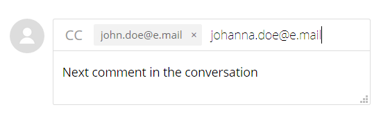

# Adobe Commerce說明中心使用手冊

在本指南中，瞭解如何將支援票證提交至 [Adobe Commerce說明中心](https://support.magento.com/hc/en-us) 並提供對Magento帳戶的共用存取權。

>[!NOTE]
>
>Adobe Commerce說明中心的知識庫部分已移轉至Adobe Experience League入口網站。 建立支援票證時，會向您建議相關知識庫文章，以及Adobe Experience League中的其他相關Adobe Commerce檔案。

**重大更新：** 2022年10月14日

**[什麼是ADOBE COMMERCE說明中心？](#what-is)**

**[支援票證](#support-tickets)**

* [登入說明中心](#login)
* [提交支援票證](#submit-ticket)

   * [說明中心起始頁面](#submit-ticket-help-center-start-page)
   * [Magento帳戶頁面](#submit-ticket-magento-account-page)
   * [雲端主控台](#submit-ticket-magento-cloud-account-page)
   * [支援票證中的資訊](#info-in-support-ticket)
   * [Adobe Commerce說明中心起始頁面上未顯示「提交票證」連結](#no-submit-link)
   * [*「請驗證您的電子郵件地址」*](#verify-email-address)
   * [票證提交表單：商家未顯示在組織下拉式清單中](#merchant-not-displayed)

* [追蹤您的票證](#track-tickets)
* [Adobe Commerce P1熱線（需要登入）](#P1-hotline)
* [Adobe Commerce共用責任運作模型（需要登入）](#shared-responsibility-operational-model)
* [說明支援票證欄位](#ticket-fields-explained)
* [票證狀態：如何處理您的請求](#ticket-status)
* [您票證中的交談](#conversation-in-ticket)
* [解析您的票證](#resolve-ticket)
* [開啟後續追蹤票證](#follow-up)

**[共用存取：授予許可權給其他使用者，讓其他使用者可以存取您的帳戶](#shared-access)**

* [誰可以提供共用存取權](#who-can-provide-shared-access)
* [提供共用存取權](#provide-shared-access)
* [撤銷（刪除）共用存取權](#revoke-shared-access)

   * [如何刪除透過雲端專案獲得共用存取許可權的使用者？](#remove-cloud-shared-access-users)

* [存取共用帳戶（切換帳戶）](#switch-accounts)
* [共用存取疑難排解](#troubleshooting-shared-access)

**[Adobe Commerce的計費常見問題集](#billing-faq)**

**[Magento U現在是ADOBE數位學習服務的一部分](#magento-u)**

## Adobe Commerce說明中心是什麼？ {#what-is}

此 [Adobe Commerce說明中心](https://support.magento.com/hc/en-us) 是Adobe Commerce的支援入口網站，合格客戶可在此提交和管理支援票證。 您也可以在此處檢閱疑難排解文章。

## 支援票證 {#support-tickets}

Adobe Commerce票證系統可讓您使用支援票證，針對所有Adobe Commerce產品，解決您在使用Adobe Commerce時遇到的特定問題。

## 登入說明中心 {#login}

登入可讓您提交、更新及回應代理程式有關支援票證的問題。

若要登入Adobe Commerce說明中心，請遵循下列步驟：

1. 請前往說明中心： <https://support.magento.com>.
1. 按一下 **登入** 位於右上角。

使用您的Magento帳戶認證登入。 如需詳細資訊，請參閱 [您的Magento帳戶](https://experienceleague.adobe.com/docs/commerce-admin/start/commerce-account/commerce-account-create.html) 在我們的使用手冊中。

### <strong>提交支援票證</strong> {#submit-ticket}

成功登入後，您可以使用說明中心起始頁面、Magento帳戶頁面和Magento雲端帳戶頁面來提交支援票證。

* 如果您是 **帳戶擁有者** 請遵循下列步驟。
* 如果您是 **共用存取許可權使用者，您必須先切換帳戶** [存取共用帳戶（切換帳戶）](#switch-accounts)，然後您可以繼續下列步驟。

#### 說明中心起始頁面 {#submit-ticket-help-center-start-page}

若要使用Adobe Commerce說明中心的起始頁面提交新的支援票證，請執行以下步驟：

1. 前往 [Adobe Commerce說明中心](https://support.magento.com/hc/en-us).
1. 按一下 **提交票證** 位於右上角。

   {width="800"}

1. 填寫欄位。
1. 按一下 **提交**.

您 **必須登入** 使用您的Magento帳戶前往說明中心以提交支援票證。 在您登入之前， [此 **提交票證** 按鈕將不會顯示](#no-submit-link).

#### Magento帳戶頁面 {#submit-ticket-magento-account-page}

若要使用「Magento帳戶」頁面提交新的支援票證，請執行下列步驟：

1. 登入您的Magento帳戶。 另請參閱 [詳細指示](https://experienceleague.adobe.com/docs/commerce-admin/start/commerce-account/commerce-account-create.html?lang=en#create-a-commerce-account) 在我們的使用手冊中。
1. 按一下 **支援** 標籤。

   {width="800"}

1. 說明中心起始頁面會為您載入。
1. 按一下 **提交票證** 位於右上角。
1. 填寫欄位。
1. 按一下 **提交**.

#### 雲端主控台 {#submit-ticket-magento-cloud-account-page}

若要使用Cloud Console提交新的支援票證，請執行以下步驟：

1. 登入 [雲端主控台](https://console.adobecommerce.com).
1. 選取 **[!UICONTROL Support]** 在使用者功能表中。
1. 此 **[!UICONTROL My Tickets]** 頁面載入。
1. 按一下 **[!UICONTROL Submit a ticket]** 位於右上角。
1. 填寫欄位。
1. 按一下 **提交**.
1. 按一下 **[!UICONTROL Submit]**.

#### 支援票證中的資訊 {#info-in-support-ticket}

標示紅色星號( **\*** )，為必要欄位，且必須填寫。 如果您將任何這些欄位留空，您將無法提交您的票證。

另請參閱 [票證欄位說明](#ticket-fields-explained) 詳細資訊請參閱下文。

### Adobe Commerce說明中心起始頁面上未顯示「提交票證」連結 {#no-submit-link}

#### 問題

您存取Adobe Commerce說明中心並想要提交支援請求，但 **提交票證** 連結未顯示在說明中心起始頁上。

#### 原因

原因可能是下列其中一項：

* 您尚未登入說明中心。
* 如果第一次使用共用存取，您尚未執行必要的步驟，以確保Adobe Commerce說明中心已透過Magento.com的SSO呼叫正確設定。
* 您的帳戶無權獲得Adobe Commerce支援(例如，您不是付費Commerce客戶或您是開放原始碼客戶)。

#### 解決方案

[登入說明中心](/help/help-center-guide/help-center/magento-help-center-user-guide.md#provide-shared-access).

此 **提交票證** 只有當客戶的電子郵件連結至有效的支援合約時，才會顯示連結。

#### 使用共用存取帳戶

若要使用共用存取帳戶來提交支援票證，您需要執行下列動作（這只需要執行一次）：

1. 接收之後 [共用存取](https://support.magento.com/hc/en-us/articles/360052444712#who-can-provide-shared-access)，登入 [magento.com網站上的Magento帳戶](https://account.magento.com/).
1. 在 **切換帳戶** 從右上角的下拉式欄位中，選取共用存取帳戶。
1. 按一下 **支援** 標籤。 這麼做將可確保Adobe Commerce說明中心已透過Magento.com對Adobe Commerce說明中心的SSO呼叫正確設定。

#### 還是看不到 **提交票證** 連結

如果您沒有 **共用帳戶** 在 **切換帳戶** 下拉式清單，但您正在為擁有Adobe Commerce授權的使用者端工作，請要求他們授予您共用存取許可權。 如需詳細資訊，請檢閱 [提供Magento帳戶的共用存取權](/help/help-center-guide/help-center/magento-help-center-user-guide.md#provide-shared-access).

如果您是Adobe Commerce授權擁有者，請確認您沒有發票包含 **未決付款** 狀態。 系統會根據發票付款狀態，自動授予或撤銷支援權益。

如何檢查您的付款狀態：

1. 登入 [magento.com](https://support.magento.com/).
1. 按一下 **帳單歷史記錄** 左側。
1. 如果您 **do** 有一張發票包含 **未決付款** 狀態， **請聯絡您的Adobe客戶團隊** 以解決付款問題。

我們僅支援具有Adobe Commerce授權之帳戶共用存取許可權的Adobe Commerce授權擁有者和帳戶。 如果您需要Magento Open Source版本的支援，請善用以下自助技術資源：

* [Adobe Commerce說明中心](https://support.magento.com/)
* [Adobe Commerce開發人員檔案](https://developer.adobe.com/commerce/docs/)
* [Adobe Commerce檔案資源](https://experienceleague.adobe.com/docs/commerce.html)
* [Magento論壇](https://community.magento.com/?_ga=2.99592990.1084044056.1559046120-720752292.1551793747)

如果您在登入帳戶時遇到問題，或您認為共用存取已正確設定，但仍無法看見 **提交票證** 按鈕，請傳送電子郵件給 [說明中心登入問題](mailto:grp-magento-helpcenterloginissues@adobe.com)，我們將很高興檢閱您的帳戶設定和支援權益。

>[!NOTE]
>
>如果您能夠提交票證，但存取雲端專案時發生問題，請勿傳送電子郵件。 請透過一般管道提交此問題的票證。

### Magento帳戶頁面上的「請驗證您的電子郵件地址」錯誤 {#verify-email-address}

如果您收到 *請驗證您的電子郵件地址* 錯誤類似於以下頁面上的 [Magento帳戶頁面](https://account.magento.com/).

{width="800"}

解決方案是驗證您的電子郵件地址：

1. 按一下 **驗證電子郵件** 按鈕(在 [編輯帳戶資訊](https://account.magento.com/customer/account/edit/) 與下方頁面類似的頁面。

   {width="800"}

1. 按一下 **驗證電子郵件** 按鈕會將電子郵件傳送至為此Magento帳戶註冊的電子郵件地址，其中包含驗證電子郵件地址的連結。
1. 按一下電子郵件驗證連結以驗證您的電子郵件並解決此問題。
1. 如果您沒有收到包含電子郵件驗證連結的電子郵件，請寄電子郵件給 [說明中心登入問題](mailto:grp-magento-helpcenterloginissues@adobe.com) 並指示您無法驗證您的電子郵件地址。

>[!NOTE]
>
>這僅適用於來自https://account.magento.com (Magento帳戶頁面)的電子郵件驗證連結。

### 票證提交表單：商家未顯示在組織下拉式清單中 {#merchant-not-displayed}

#### 問題

必要條件：您擁有商家授予的共用存取帳戶。

要再現的步驟：

1. 使用您的共用帳戶登入說明中心。
1. 按一下 **提交票證** 連結。 票證提交表單隨即開啟。
1. 展開 **組織** 下拉式欄位以選取貿易商。

預期結果：

與共用帳戶對應的商家會列在 **組織** 選項。

實際結果：

與已使用共用帳戶對應的商家在中無法使用 **組織** 選項。

#### 解決方案

從商家取得共用存取許可權後，您需要執行下列步驟（僅一次）：

1. 登入您的 [magento.com網站上的Magento帳戶](https://account.magento.com/).
1. 在 **切換帳戶** 從右上角的下拉式欄位中，選取共用存取帳戶。
1. 按一下 **支援** 標籤。 這麼做將可確保Adobe Commerce說明中心已透過Magento.com對Adobe Commerce說明中心的SSO呼叫正確設定。

如果您已這麼做，請檢查您是否已被授權 *共用一個以上商家的存取權* 按一下 [[!UICONTROL Shared with me] 索引標籤在您的帳戶上](https://account.magento.com/grantor/manage/shared/)：
* 若只有一個 [!UICONTROL Share Name] 列於清單中，即您僅獲一位商家授予， *您將不會看到 [!UICONTROL Organization] 下拉式清單*.
* 如果有多個 [!UICONTROL Share Names]，該商家的支援權益可能已過期，因為其授權先前因付款問題而遭撤銷。

### 追蹤您的票證 {#track-tickets}

您的票證就是您符合以下條件的票證：

* 已親自提交
* 已透過CC (carbon copy)新增為監看員

#### 檢視您的票證

若要列出您的所有票證，請按一下「說明中心」開始頁面上的設定檔功能表（右上角），然後選取 **我的票證**.

{width-&quot;800&quot;}

若要在票證與已寄送的票證之間切換，請按一下對應的標籤：

* **我的票證**
* **我寄送的票**
* **組織票證** （若您的帳戶與數個組織相關聯，則可使用）

若要排序票證，請按一下 **已建立** 或 **上次活動** 欄標題。

#### 搜尋票證

若要尋找票證，請在 **搜尋票證** 欄位並按 *輸入* 在鍵盤上。 選取 [狀態](#ticket-status) 以進行其他篩選。

#### 關注組織票證

您可以依照組織成員提交的支援票證。

當您關注組織門票時，您可以：

* 可檢視以下範圍內的票證： **組織票證** 標籤
* 提交新票證或變更現有票證時，收到電子郵件通知

若要關注/取消關注組織的票證：

1. 前往 **我的票證** > **組織票證** 標籤。
1. 在功能表中選取組織，然後按一下 **關注/取消關注**.

### Adobe Commerce P1熱線 {#P1-hotline}

**需要登入** 以存取 [Adobe Commerce P1熱線](https://experienceleague.adobe.com/docs/commerce-knowledge-base/kb/how-to/adobe-commerce-p1-notification-hotline.html) 文章提供P1熱線號碼，Adobe Commerce在P1事件期間尋求協助時可使用此號碼，並說明應提供的資訊。

### Adobe Commerce分擔責任運作模式 {#shared-responsibility-operational-model}

**需要登入** 以存取 [Adobe Commerce分擔責任運作模式](https://support.magento.com/hc/en-us/articles/4407700678669) 本文章旨在釐清Adobe Commerce的營運責任，僅針對我們的專業基礎建設服務。

### 說明支援票證欄位 {#ticket-fields-explained}

#### 受影響的URL

連結至Adobe Commerce支援團隊能夠看見您問題的環境。 請務必以「http://」或「https://」啟動URL。

#### 附件

附加記錄、熒幕擷取畫面、錄影或任何其他媒體，以更好地說明您的問題。

#### Backoffice URL （僅限MOM）

URL必須以「https://」開頭。 其格式通常為：商家名稱+&quot;.mcom.magento.com/admin/login&quot;，例如&quot;https://luma.mcom.magento.com/admin/login&quot;。

您也可以放置與問題相關的直接連結。

#### CC

您要追蹤票證之人員的電子郵件(例如， *first@e.mail*)。

您可以新增沒有Magento帳戶或Zendesk帳戶之人員的電子郵件；這些人員仍可在您的票證中貢獻對話。

若要新增多封電子郵件至CC：

>[!NOTE]
>
>CC：中的使用者必須在https://account.magento.com擁有現有帳戶。 如果沒有，他們必須先在https://account.adobe.com建立帳戶，然後使用該帳戶登入https://account.magento.com。

1. 輸入電子郵件。
1. 按下 *空格* 以儲存輸入的電子郵件。 電子郵件會以灰色框架顯示。\
   
1. 開始輸入下一封電子郵件。
1. 按下以儲存所有其他電子郵件 *空格*.

若要從副本刪除電子郵件：請按一下 **x** 在框架式電子郵件中。

#### 產品

選取您使用的Adobe Commerce產品型別：

* Adobe Commerce：此 **[!UICONTROL Implementation Type]** 欄位會在您選取此選項後顯示（請參閱下方以瞭解詳細資訊）
* Magento Order Management
* Adobe Commerce報告：不包括 [進階報告](https://experienceleague.adobe.com/docs/commerce-admin/config/general/advanced-reporting.html)
* Adobe Commerce [付款服務](https://experienceleague.adobe.com/docs/commerce-merchant-services/payment-services/overview.html)
* Adobe Commerce服務： [頻道管理員](https://experienceleague.adobe.com/docs/commerce-channels/channel-manager/guide-overview.html) 僅限

#### 實作型別

此欄位僅會在您選取後顯示 **[!UICONTROL Product]** = *Adobe Commerce*

請指定您的部署方法：

* 雲端：只有在您位於雲端基礎結構上的Adobe Commerce上時，才選擇此選項
* 內部部署： *所有自行託管的執行個體以及 [AWS] 雲端託管* (雲端上的Adobe Commerce除外)

#### 雲端專案URL

請提供雲端主控台專案的URL，例如， `https://console.adobecommerce.com/<owner-user-name>/<project-ID>`.

另一種取得專案URL的方法如下：

1. 登入 [雲端主控台](https://console.adobecommerce.com).
1. 按一下適當的專案。
1. 複製URL。

#### 聯絡原因

連絡理由因產品而異。 選擇最適合您所經歷之症狀的連絡原因。 請參閱 [支援票證連絡人原因說明](/help/faq/general/support-ticket-contact-reason-descriptions.md) 文章，以進一步瞭解您應該選擇哪些聯絡原因。

#### Adobe Commerce環境ID

此欄位僅會在您選取後顯示 **[!UICONTROL Contact Reason]** = *Adobe Commerce Cloud應用程式*，後接 **Adobe Commerce應用程式聯絡原因** = *[!DNL Live Search]*.
前往 **[!UICONTROL System]** > **[!UICONTROL Services]** > **[!UICONTROL Commerce Services Connector]** > **[!UICONTROL SaaS Identifier]**，並提供 *[!UICONTROL Data Space ID]*.

#### （資料）整合型別(僅限Adobe Commerce報表)

選取您在Adobe Commerce報表中的整合型別。 這可協助我們的工程師更有效率地解決您的問題。

#### 說明

儘可能加入問題的概觀，並儘可能提供許多詳細資訊。

請提供精確詳細資訊和重現步驟(Adobe Commerce內部部署和雲端基礎結構除外，兩者之間有獨立的 [重現問題的步驟](#steps) 欄位)，以及您的問題或請求的症狀。 請務必加入所有受影響的SKU、相關資料點以及其他相關連結。

#### 環境(僅限雲端基礎結構上的Adobe Commerce、內部部署的Adobe Commerce、Adobe Commerce報表和送貨)

選取 **環境型別** 您面臨問題的方面：

* 開發(**整合分支**)
* 分段
* 生產

進一步瞭解Adobe Commerce在雲端基礎結構環境中的 [Pro架構](https://experienceleague.adobe.com/docs/commerce-cloud-service/user-guide/architecture/pro-architecture.html) 使用手冊中的文章。

#### 受影響的訂單數（僅限MOM）

選取受影響的訂單範圍。

此為下拉式清單，僅適用於「訂單管理系統」產品。

#### 組織

指定您希望票證關聯的組織 — 如果您使用多個組織。

當您的帳戶與多個組織相關聯時，此欄位就會顯示。

>[!WARNING]
>
>您必須確定您已選取正確的組織。 如果您選取錯誤的組織，與組織無關的第三方將可檢視潛在敏感和專屬資訊。

>[!NOTE]
>
>提交票證後，即可變更組織。 請依照下列步驟變更組織。
>
>1. 移至票證的右欄。
>1. 找到可用組織的下拉式清單。
>1. 選取適當的組織。
>
>

此外，這可讓我們快速交叉參考過去為此組織提交的類似/重複/相關票證，並找出可能有助於調查和解決目前票證的線索。

如果您擁有多個組織的共用存取權，但此欄位無法使用，請參閱 [票證提交表單：商家未顯示在組織下拉式清單中](https://experienceleague.adobe.com/docs/commerce-knowledge-base/kb/help-center-guide/magento-help-center-user-guide.html#merchant-not-displayed)

#### 合作夥伴名稱（商家名稱）

商戶須知： **合作夥伴名稱** 是開發組織(Adobe Commerce)的名稱 [技術合作夥伴](https://partners.magento.com/portal/directory/?&amp;partner_type=6) 或 [解決方案合作夥伴](https://partners.magento.com/portal/directory/?&amp;partner_type=1))參與開發您的Adobe Commerce商店。

合作夥伴： **商家名稱** 是客戶的名稱。

#### 專案URL (僅限Commerce Cloud)

連結至 [雲端主控台](https://experienceleague.adobe.com/docs/commerce-cloud-service/user-guide/project/overview.html).

#### 重現問題的步驟(僅限雲端基礎結構上的Adobe Commerce內部部署和Adobe Commerce)

提供確切的逐步指示，以重現您的問題，包括：

* 復寫步驟
* 預期結果
* 實際結果

*建議：* 假設您正在為知道這些步驟的人撰寫這些步驟 **無** 關於Adobe Commerce：

* 提及每個步驟，即使看起來簡單明瞭
* 不要依賴讀者知道您意思的假設

用簡單的語言寫作，有簡短句子。

#### 主旨

包含問題的簡短概觀(例如， *所有頁面均顯示錯誤404* )。

**建議的文章：** 當您輸入搜尋詞時，可能會顯示與您問題有關的AdobeCommerce檔案文章清單。 按一下清單中的文章以開啟它。

*建議：* 請仔細考慮建議的文章，其中可能包含您希望Adobe Commerce支援團隊提供的解決方案。

#### 版本(僅限內部部署的Adobe Commerce、雲端基礎結構上的Adobe Commerce和送貨)

請選取您請求協助的Adobe Commerce版本。 頂端會列出所有支援的Adobe Commerce版本。 不支援的版本會以括弧列在底部。 如果您正在移轉，請選取最新版本以確保系統支援您。

若要尋找Adobe Commerce （雲端基礎結構）的版本，請向下捲動 [雲端主控台](https://experienceleague.adobe.com/docs/commerce-cloud-service/user-guide/project/overview.html) 頁面並勾選視窗的中下方。

如果您使用 [Elasticsearch](https://experienceleague.adobe.com/docs/commerce-operations/installation-guide/prerequisites/search-engine/overview.html) 或 [OpenSearch](https://experienceleague.adobe.com/docs/commerce-operations/installation-guide/prerequisites/search-engine/aws-opensearch.html)，請勿選取此選項。

若要取得此資訊，請在Adobe Commerce管理員中，前往 **行銷** > **即時搜尋** > **GraphQL遊樂場**，向下捲動至頁面底部，然後按一下 **HTTP標頭**.

### 票證狀態：票證的處理方式 {#ticket-status}

您的票證可能具有這三種狀態之一。

#### **1. 開啟**

您的票證尚未解決，正由Adobe Commerce支援團隊處理。 當您在交談的特定步驟中提供所有您預期的資訊，且下一步需要由Adobe Commerce支援人員採取時，您的票證具有 **開啟** 狀態。

#### **2. 正在等待您的回覆**

Adobe Commerce支援部門期待您提供資訊。

在您的回覆中，您可以指定問題的其他技術細節、提供向上呈報細節，或說明是否由Adobe Commerce支援提供的解決方案已被證明對您的問題有幫助。 請務必儘快提供回覆，因為票證位於「 」時，Adobe Commerce支援無法繼續處理您的票證 **正在等待您的回覆** 狀態。

參考 [Adobe Commerce支援票證生命週期原則更新](/help/help-center-guide/help-center/magento-support-ticket-lifecycle-policy-update.md) 文章以取得有關時間與通知原則的詳細資訊。

#### **3. 已解決**

Adobe Commerce支援已針對您的問題提供解決方案，而您也同意其有所幫助。 是您標籤票證為 **已解決**. 如果問題再次發生，您可以重新開啟票證，並將其狀態設定回 **開啟**.

### 您票證中的交談 {#conversation-in-ticket}

您票證中的交談會整合您或Adobe Commerce支援團隊所撰寫的所有註解。 註解會以最新（頂端）到最早（底部）的順序顯示。

若要新增註解至交談，請依照下列步驟執行：

1. 捲動至票證底部。
1. 按一下 **新增至交談** 開始寫入的欄位。

   

1. 若要新增個人到您的評論，請在以下欄位中指定電子郵件： **CC** 評論欄位的欄位。
   >[!NOTE]
   >
   >CC：中的使用者必須在https://account.magento.com擁有現有帳戶。 如果沒有，他們必須先在https://account.adobe.com建立帳戶，然後使用該帳戶登入https://account.magento.com。

   

1. 完成註解後，請按一下 **提交**.

### 解析您的票證 {#resolve-ticket}

若要解析票證，請按一下 **標籤為已解決** 位於票證底部。

### 開啟後續追蹤票證 {#follow-up}

開啟後續票證將確保原始問題已連結到後續票證以實現連續性。

若要開啟後續追蹤票證，請按一下「*建立後續追蹤*」位於您要建立後續追蹤的票證底部的連結。

## 共用存取：授予許可權給其他使用者，讓其他使用者可以存取您的帳戶 {#shared-access}

您可以授予其他Magento帳戶持有人對您帳戶的有限存取權。 尤其是，使用 **共用存取** 功能，您可以為受信任的員工和服務供應商提供使用您的「說明中心」帳戶的許可權，以便他們可以使用您的支援票證。

您可以使用位於的Magento帳戶頁面來提供及管理共用存取權 [https://account.magento.com](https://account.magento.com/).

### 誰可以提供共用存取權 {#who-can-provide-shared-access}

只有具有相應許可權的帳戶擁有者（主要帳戶持有者）才能為其他使用者提供共用存取權。

管理使用者及其存取權是客戶的責任，尤其是在共用存取觀點中。 因此，Adobe Commerce支援團隊無法代表客戶提供對Magento帳戶的共用存取權。 建議客戶透過 [Magento帳戶頁面](https://account.magento.com/).

已提供共用存取許可權的使用者無法將此存取許可權轉移或授予其他使用者。

### 提供共用存取權 {#provide-shared-access}

請參閱 [共用您的帳戶](https://experienceleague.adobe.com/docs/commerce-admin/start/commerce-account/commerce-account-share.html) Adobe Commerce區段，以取得設定共用帳戶的詳細步驟。

為新使用者提供共用存取權後，相關資訊可在以下欄位取得： **共用存取** > **管理許可權** ，位於您的「Magento帳戶」頁面。

{width="800"}

### 撤銷（刪除）共用存取權 {#revoke-shared-access}

1. 請在登入您的Magento帳戶 [https://account.magento.com](https://account.magento.com/).
1. 在左側面板的「共用存取」下方，選擇 **管理許可權。**
1. 尋找要撤銷其共用存取許可權的使用者，然後按一下 {width="25"} 在使用者列中(**動作** 欄)。
1. 按一下 **刪除使用者** 以撤銷存取權，或上方角落的X以取消撤銷。

   {width="800"}

   您也可以使用撤銷共用存取權 **編輯** 功能表：

1. 請在登入您的Magento帳戶 [https://account.magento.com](https://account.magento.com/).
1. 在左側面板的「共用存取」下方，選擇 **管理許可權。**
1. 尋找要撤銷其共用存取許可權的使用者，然後按一下 **編輯** 在使用者列中(**動作** 欄)。
1. 按一下 **刪除此使用者** ，位於頁面底部。
1. 在確認快顯視窗中，按一下 **刪除使用者** 以撤銷存取權，或上方角落的X以取消撤銷。

### 如何刪除透過雲端專案獲得共用存取許可權的使用者？ {#remove-cloud-shared-access-users}

<u>受影響的產品和版本</u>

* Adobe Commerce Cloud （所有版本）

<u>原因</u>

如果您有/曾經擁有Adobe Commerce Cloud專案，並且已將使用者新增至專案，系統會自動授予他們專案擁有者影像ID的共用存取權。 這通常會在以下欄位中指示： **[!UICONTROL Share Name]** 欄，顯示 *來自MAG的雲端共用存取[XYZ]*.

如果缺少DELETE連結，表示已透過Commerce Cloud自動授與共用存取權。

<u>解決方案</u>

無法刪除共用名稱為的「共用存取權」使用者清單 *來自MAG的雲端共用存取[XYZ]* 如果未在此頁面上新增/提供「共用存取」。 這些檔案會保留以供參考/稽核之用。

不過，一旦您撤銷了這些共用存取許可權使用者的許可權，他們便無法再擁有該存取權。

1. 請在登入您的Magento帳戶 [https://account.magento.com](https://account.magento.com/).
1. 在左側的面板中，在 *[!UICONTROL Shared Access]*，選擇 **[!UICONTROL Manage Permissions]**.
1. 尋找要撤銷其共用存取許可權的使用者，然後按一下 **[!UICONTROL Edit]** 在使用者列中(*[!UICONTROL Actions]* 欄)。
1. 取消勾選下的所有資源 *[!UICONTROL Grant Account Permissions]*.

{width="800"}

如需詳細資訊，請參閱 [管理使用者存取](https://experienceleague.adobe.com/docs/commerce-cloud-service/user-guide/project/user-access.html#manage-users-from-the-project-web-interface) 有關雲端基礎結構指南中Commerce的檔案。

### 存取共用帳戶（切換帳戶） {#switch-accounts}

若要使用為您提供的共用存取權，請遵循下列步驟：

1. 請在登入您的Magento帳戶 [https://account.magento.com](https://account.magento.com/).
1. 按一下 **切換帳戶** 功能表並選取帳戶。

   {width="800"}

若要瞭解您目前使用的帳戶（您自己的原生帳戶或共用存取權），請參閱 **切換帳戶** 功能表：顯示作用中的帳戶。

### 共用存取疑難排解 {#troubleshooting-shared-access}

請參閱 [共用存取疑難排解文章](/help/troubleshooting/miscellaneous/shared-access-troubleshooting.md) 在我們的支援知識庫中。

## Adobe Commerce的計費常見問題集 {#billing-faq}

商戶通常以信用卡(CC)交易支付我們的服務費用，而且 [Adobe Commerce的計費常見問題集](/help/faq/general/billing-faq-for-adobe-commerce.md) 是在您支付帳單時提供協助的資源。

## Magento U現在是ADOBE數位學習服務的一部分 {#magento-u}

MagentoU已與 [Adobe數位學習服務(ADLS)](https://learning.adobe.com/).

MagentoU Zendesk將逐步淘汰。
