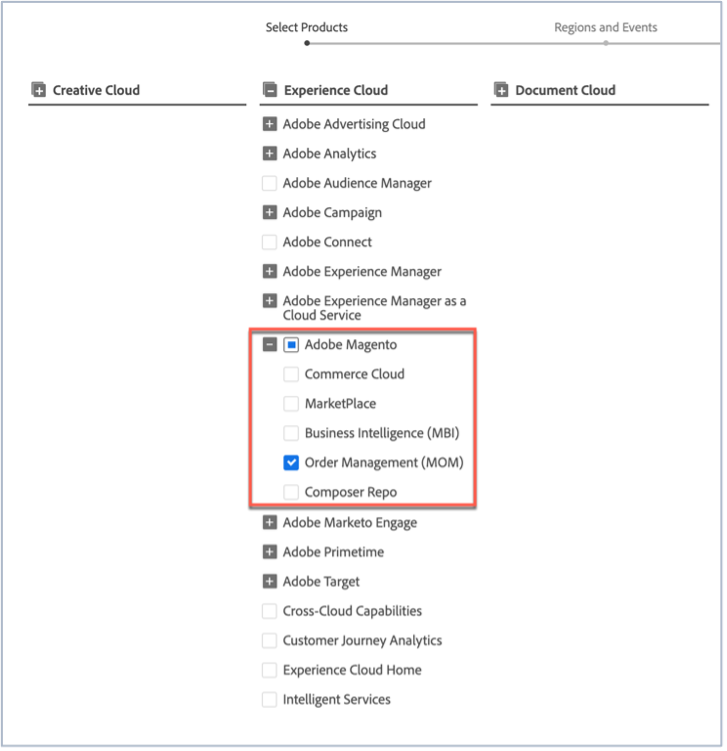

# 如何訂閱Adobe Commerce狀態更新

## 如何訂閱AdobeMagento狀態更新

1. 移至[Adobe狀態](https://status.adobe.com)。
1. 按一下&#x200B;**登入**。
1. 使用您的Adobe認證登入。
1. 如果出現此選項，請選取&#x200B;**公司或學校帳戶**。
1. 按一下右上角所列雲端上方的&#x200B;**管理訂閱**。

   
1. 按一下&#x200B;**建立訂閱**。

   
1. 您會看到一個視窗，您可以在其中選取產品的通知。 它可能與下列熒幕擷圖不同，因為某些訂閱可能會根據您的設定檔預先選取，或因為您已設定某些訂閱。 按一下Experience Cloud底下的&#x200B;**AdobeMagento**。 如果您想要接收所有AdobeMagento服務的通知，請勾選「AdobeMagento」核取方塊。 這會自動選取所有您可以在AdobeMagento區段展開時看到的AdobeMagento服務（請參閱熒幕擷圖）。

   

   或者，若要選取一個AdobeMagento服務，請取消勾選其他AdobeMagento服務的核取方塊。 因此，舉例來說，如果您只想接收Order Management (MOM)的通知，請取消勾選其他服務，這樣系統只會勾選「AdobeMagento」核取方塊和「Order Management (MOM)」核取方塊（請參閱熒幕擷圖）。

   
1. 您會看到一個視窗，您可以在其中選取特定區域和事件的產品通知。 如果您想要接收所有產品相同地區和事件型別的通知，請核取&#x200B;**選取所有產品的地區和事件型別**&#x200B;核取方塊（請參閱熒幕擷圖）。

   

   或者，如果您已訂閱數個產品(不只是AdobeMagento)，並且希望每個產品都有不同地區和事件型別的通知，請核取&#x200B;**依產品自訂地區和事件型別**&#x200B;核取方塊（請參閱熒幕擷圖）。

   
1. 按一下&#x200B;**繼續**。
1. 會顯示&#x200B;**確認您的訂閱偏好設定**&#x200B;視窗。 檢查通知是否反映您想要的內容。 按一下&#x200B;**完成**。

按一下&#x200B;**完成**&#x200B;之後，您應該會看到產品訂閱和活動訂閱的摘要，並且您會收到來自Adobe的電子郵件，標題為「訂閱狀態電子郵件通知」。 如果您想要取消訂閱和/或變更通知設定，請重複步驟一到九。
