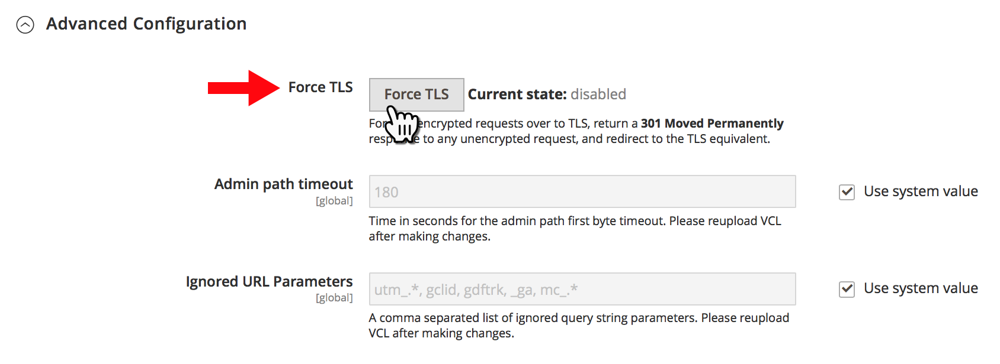

# 針對雲端基礎結構上Adobe Commerce的所有頁面，將HTTP重新導向至HTTPS （強制TLS）

在Commerce管理員中啟用Fastly的&#x200B;**強制TLS**&#x200B;功能，以針對雲端基礎結構存放區上Adobe Commerce的所有頁面啟用全域HTTP到HTTPS重新導向。

本文提供詳細的[步驟](#steps)、強制TLS功能的快速總覽、受影響的版本以及相關檔案的連結。

## 步驟 {#steps}

### 步驟1：設定安全URL {#step-1-configure-secure-urls}

在此步驟中，我們會定義存放區的安全URL。 如果已經完成，請移至[步驟2：啟用強制TLS](#step-2-enable-force-tls)。

1. 登入Commerce管理員。
1. 瀏覽至&#x200B;**商店** > **設定** > **一般** > **網頁**。
1. 展開&#x200B;**基礎URL （安全）**&#x200B;區段。    
1. 在&#x200B;**安全基底URL**&#x200B;欄位中，指定您商店的HTTPS URL。
1. 將&#x200B;**在店面上使用安全URL**&#x200B;和&#x200B;**在管理員上使用安全URL**&#x200B;設定設定設為&#x200B;**是**。    
1. 按一下右上角的&#x200B;**儲存設定**&#x200B;以套用變更。

使用手冊中的&#x200B;**相關檔案：**   [儲存URL](https://experienceleague.adobe.com/zh-hant/docs/commerce-admin/stores-sales/site-store/store-urls)。

### 步驟2：啟用強制TLS {#step-2-enable-force-tls}

1. 在Commerce管理員中，瀏覽至&#x200B;**商店** > **設定** > **進階** > **系統**。
1. 展開&#x200B;**完整頁面快取**&#x200B;區段，然後展開&#x200B;**Fastly設定**，再展開&#x200B;**進階設定**。
1. 按一下&#x200B;**強制TLS**&#x200B;按鈕。    
1. 在出現的對話方塊中，按一下&#x200B;**上傳**。    
1. 對話方塊關閉後，請確定「強制TLS」目前的狀態顯示為&#x200B;**已啟用**。    

**相關的Fastly檔案：**   適用於Adobe Commerce 2的[強制TLS指南](https://github.com/fastly/fastly-magento2/blob/master/Documentation/Guides/FORCE-TLS.md)。

## 關於強制TLS

TLS （傳輸層安全性）是一種安全HTTP連線的通訊協定，取代了較不安全的上一代 — SSL （安全通訊端層）通訊協定。

Fastly的Force TLS功能可讓您強制將網站頁面的所有傳入未加密請求傳送到TLS。

&#x200B;>>
其運作方式是傳回&#x200B;*301 Moved Permanently*&#x200B;回應給任何未加密的請求，這會重新導向至TLS同等專案。 例如，若對&#x200B;*http://www.example.com/foo.jpeg*&#x200B;提出請求，將會重新導向至&#x200B;*https://www.example.com/foo.jpeg*。

[保護通訊安全](https://docs.fastly.com/guides/securing-communications/) （Fastly檔案）

## 受影響的版本

* 雲端基礎結構上的&#x200B;**Adobe Commerce：**
   * 版本： 2.1.4和更新版本
   * 計畫：雲端基礎結構上的Adobe Commerce雲端基礎結構上的入門計畫架構和Adobe Commerce Pro計畫架構（包括Pro Legacy）
* **Fastly：** 1.2.4

## 路由不需要變更.yaml

若要在您商店的&#x200B;**所有**&#x200B;頁面上啟用HTTP至HTTPS重新導向，您不需要將頁面新增至`routes.yaml`設定檔 — 為您的整個商店啟用「全域強制TLS」(使用Commerce管理員)就足夠了。

## 相關Fastly檔案

* [Adobe Commerce 2](https://github.com/fastly/fastly-magento2/blob/master/Documentation/Guides/FORCE-TLS.md)的強制TLS指南
* [強制TLS重新導向](https://docs.fastly.com/guides/securing-communications/forcing-a-tls-redirect)
* [保護通訊安全](https://docs.fastly.com/guides/securing-communications/)
