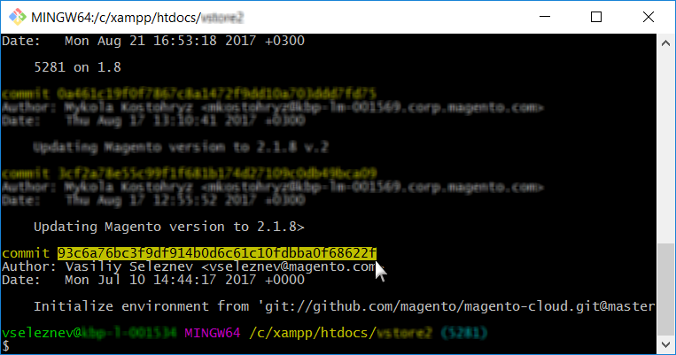

# 復原沒有雲端快照的環境

本文說明兩種解決方案，可復原環境，而不會在雲端基礎結構上的Adobe Commerce上擁有環境的快照。

## 受影響的產品和版本

* 雲端基礎結構上的Adobe Commerce，[所有支援的版本](https://magento.com/sites/default/files/magento-software-lifecycle-policy.pdf)

選擇最適合您的案例：

* 如果您有穩定的組建，但沒有有效的快照 — [案例1：沒有快照，組建穩定（可使用SSH連線）](#scen2)。
* 如果組建已中斷，而且您沒有有效的快照 — [案例2：沒有快照；組建已中斷（沒有SSH連線）](#scen3)。

## 案例1：沒有快照、建置穩定（可用SSH連線） {#scen2}

本節說明當您尚未建立快照，但可透過SSH存取環境時，如何復原環境。

步驟如下：

1. 停用組態管理。
1. 解除安裝Adobe Commerce軟體。
1. 重設Git分支。

執行這些步驟後：

* 您的Adobe Commerce安裝會回到其Vanilla狀態（資料庫已還原；部署組態已移除；`var`下的目錄已清除）
* 您的Git分支會重設為過去所需的狀態

請閱讀以下詳細步驟：

### 步驟0 （先決條件）：移除config.php以停用「組態管理」 {#disable_config_management}

我們需要停用「組態管理」，以免在部署期間自動套用先前的組態設定。

若要停用「組態管理」，請確定您的`/app/etc/`目錄不包含`config.php` (適用於Adobe Commerce 2.4.x)或`config.local.php` (適用於Adobe Commerce 2.1.x)檔案。

若要移除組態檔，請遵循下列步驟：

1. [SSH至您的環境](https://experienceleague.adobe.com/docs/commerce-cloud-service/user-guide/develop/secure-connections.html)。
1. 移除設定檔：
   * 若為Adobe Commerce 2.4：

   ```php
    rm app/etc/config.php
   ```

   * 若為Adobe Commerce 2.1：

   ```php
     rm app/etc/config.local.php
   ```

在開發人員檔案中檢閱商店設定的[組態管理](https://experienceleague.adobe.com/docs/commerce-cloud-service/user-guide/configure-store/store-settings.html)，以進一步瞭解組態管理。

### 步驟1：使用setup:uninstall命令解除安裝Adobe Commerce軟體 {#setup-uninstall}


解除安裝Adobe Commerce軟體會捨棄並還原資料庫、移除部署設定，以及清除`var`下的目錄。

檢閱我們的開發人員檔案中的[解除安裝Adobe Commerce軟體](https://experienceleague.adobe.com/docs/commerce-operations/installation-guide/tutorials/uninstall.html)。

若要解除安裝Adobe Commerce軟體，請遵循下列步驟：

1. [SSH至您的環境](https://experienceleague.adobe.com/docs/commerce-cloud-service/user-guide/develop/secure-connections.html)。
1. 執行`setup:uninstall`：

   ```php
     php bin/magento setup:uninstall
   ```

1. 確認解除安裝。

系統會顯示下列訊息，確認解除安裝成功：

```php
[SUCCESS]: Magento uninstallation complete.
```

這表示我們已將Adobe Commerce安裝（包括DB）還原為其正版(Vanilla)狀態。

### 步驟2：重設Git分支 {#reset-git-branch}

透過Git重設，我們會將程式碼恢復到過去所需的狀態。

1. 將環境複製到本機開發環境。 您可以在Cloud Console中複製命令：    
1. 存取認可歷史記錄。 使用`--reverse`以相反順序顯示歷程記錄，以方便使用：

   ```git
     git log --reverse
   ```

1. 選取您擅長的認可雜湊。 若要將程式碼重設為真實狀態(Vanilla)，請尋找建立分支（環境）的第一個認可。    
1. 套用硬Git重設：

   ```git
     git reset --h <commit_hash>
   ```

1. 將變更推送至伺服器：

   ```git
     git push --force <origin> <branch>
   ```

執行這些步驟後，我們的Git分支會重設，並且整個Git變更記錄檔都會清除。 最後一個Git推送會觸發重新部署，以套用所有變更並重新安裝Adobe Commerce。

## 案例2：沒有快照；建置損毀（沒有SSH連線） {#scen3}

本節說明如何在環境處於嚴重狀態時復原環境：建置程式無法成功建置運作中的應用程式，因此導致SSH連線無法使用。

在這種情況下，您必須先使用Git重設還原Adobe Commerce應用程式的工作狀態，然後解除安裝Adobe Commerce軟體（若要卸除並還原資料庫、移除部署設定等）。 此情境涉及與情境1相同的步驟，但步驟順序不同，並且有另一個步驟 — 強制重新部署。 步驟如下：

[1.重設Git分支。](/help/how-to/general/reset-environment-on-cloud.md#reset-git-branch)

[2。 停用組態管理。](/help/how-to/general/reset-environment-on-cloud.md#disable_config_management)

[3.解除安裝Adobe Commerce軟體。](/help/how-to/general/reset-environment-on-cloud.md#setup-uninstall)

4&amp;amp；句點；強制重新部署。

執行這些步驟後，您將會獲得與案例1相同的結果。

### 步驟4：強制重新部署

提交認可（這可能是空的認可，雖然我們不建議這麼做）並將其推送到伺服器以觸發重新部署：

```git
git commit --allow-empty -m "<message>" && git push <origin> <branch>
```

## 如果安裝:uninstall失敗，請手動重設資料庫

如果執行`setup:uninstall`命令失敗並出現錯誤，而且無法完成，我們可以使用以下步驟手動清除DB：

1. [SSH至您的環境](https://experienceleague.adobe.com/docs/commerce-cloud-service/user-guide/develop/secure-connections.html)。
1. 連線至MySQL資料庫：

   ```sql
   mysql -h database.internal
   ```

1. 卸除`main`資料庫：

   ```sql
   drop database main;
   ```

1. 建立空的`main`資料庫：

   ```sql
   create database main;
   ```

1. 刪除下列組態檔： `config.php`、`config.php` `.bak`、`env.php`和`env.php.bak`。

重設DB後，[將Git推送至環境以觸發重新部署](https://experienceleague.adobe.com/docs/commerce-cloud-service/user-guide/dev-tools/cloud-cli.html#git-commands)，並將Adobe Commerce安裝至新建立的DB。 或[執行重新部署命令](https://experienceleague.adobe.com/docs/commerce-cloud-service/user-guide/dev-tools/cloud-cli.html#environment-commands)。

## 相關閱讀

在我們的開發人員檔案中：

* [還原雲端上的快照](https://experienceleague.adobe.com/en/docs/commerce-cloud-service/user-guide/develop/storage/snapshots#restore-a-manual-backup)
* [建立快照](https://experienceleague.adobe.com/en/docs/commerce-cloud-service/user-guide/develop/storage/snapshots#create-a-manual-backup)
* [快照和備份管理](https://experienceleague.adobe.com/en/docs/commerce-cloud-service/user-guide/develop/storage/snapshots)
* [使用Cloud Console管理分支 — 檢視記錄](https://experienceleague.adobe.com/docs/commerce-cloud-service/user-guide/project/console-branches.html?lang=en#view-logs)
* [元件部署失敗](https://experienceleague.adobe.com/docs/commerce-cloud-service/user-guide/develop/deploy/recover-failed-deployment.html)
* [管理您的專案](https://experienceleague.adobe.com/docs/commerce-cloud-service/user-guide/project/overview.html#configure-the-project)
