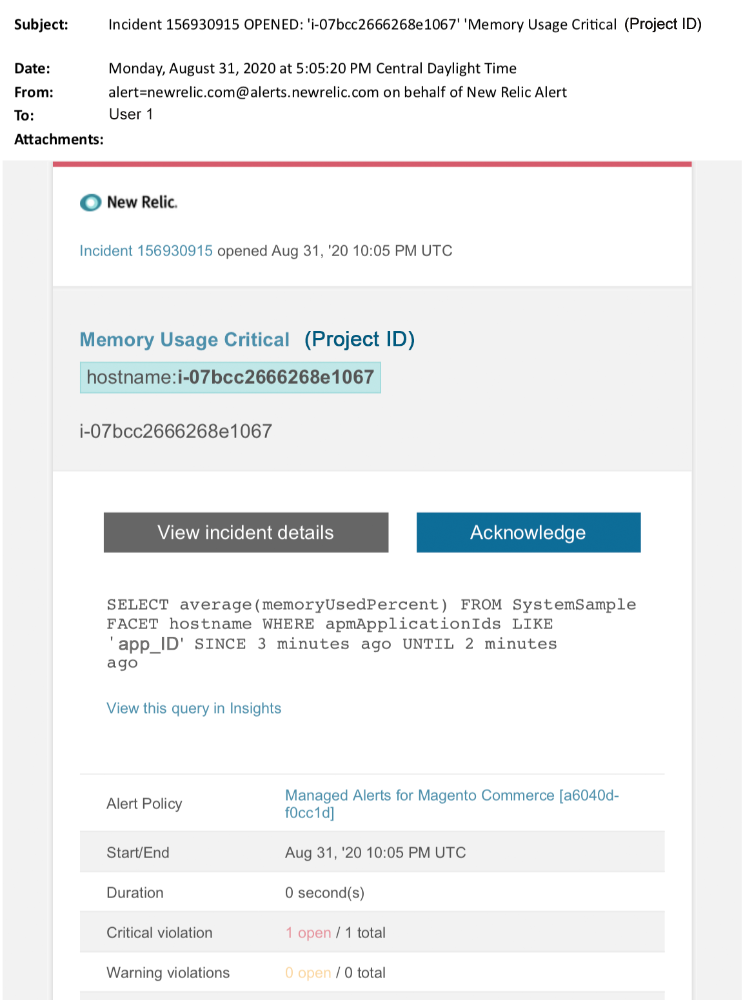

# Adobe Commerce上的受管理警報：記憶體嚴重警報

本文提供當您在New Relic中收到Adobe Commerce的記憶體嚴重警示時的疑難排解步驟。 需要立即採取行動來解決問題。 根據您選取的警報通知通道，警報看起來類似以下內容。

{width="500"}

## 受影響的產品和版本

雲端基礎結構專業版的所有版本Adobe Commerce規劃架構。

## 問題

如果您已為Adobe Commerce](/help/support-tools/managed-alerts-for-adobe-commerce/managed-alerts-for-magento-commerce.md)註冊最多[個受管理警報，且一個或多個警報臨界值已超出，您將會在New Relic中收到受管理警報。 這些警報由Adobe開發，使用支援和工程部門的見解為客戶提供標準集合。

<u> **做！** </u>

* 中止任何排定的部署，直到清除此警示為止
* 如果您的網站沒有回應或完全沒有回應，請立即將網站置於維護模式。 如需相關步驟，請參閱開發人員檔案中的[安裝指南>啟用或停用維護模式](https://experienceleague.adobe.com/en/docs/commerce-operations/installation-guide/tutorials/maintenance-mode)。 請務必將您的IP新增至劐免IP位址清單，以確保您仍可存取您的網站以進行疑難排解。 如需相關步驟，請參閱我們的開發人員檔案中的[維護劐免IP位址清單](https://experienceleague.adobe.com/en/docs/commerce-operations/installation-guide/tutorials/maintenance-mode#instgde-cli-maint-exempt)。

<u>**不要！**</u>

* 啟動其他行銷活動，為您的網站帶來其他頁面檢視。
* 執行索引器或其他cron，可能會對CPU或磁碟造成額外的壓力。
* 執行任何主要管理工作(例如Commerce管理、資料匯入/匯出)。
* 清除您的快取。

如果您在調查並解決警示原因之前，執行了任何「不執行」動作，您的網站可能會停止回應（如果您尚未發生網站中斷）。

## 解決方案

請依照下列步驟，找出原因並加以疑難排解。

>[!WARNING]
>
>由於這是嚴重警示，強烈建議您先完成&#x200B;**步驟1**，再嘗試疑難排解問題（從步驟2開始）。

1. 檢查Adobe Commerce支援票證是否存在。 如需相關步驟，請參閱我們的支援知識庫中的[追蹤您的支援票證](/help/help-center-guide/help-center/magento-help-center-user-guide.md#track-tickets)。 支援人員可能已經收到New Relic臨界值警報、建立了票證並開始處理問題。 如果票證不存在，請建立一個。 票證應具有下列資訊：
   * 聯絡原因：選取「已收到New Relic嚴重警示」
   * 警示的說明
   * [New Relic事件連結](https://docs.newrelic.com/docs/alerts-applied-intelligence/new-relic-alerts/alert-incidents/view-violation-event-details-incidents)。 這包含在您的[Adobe Commerce](/help/support-tools/managed-alerts-for-adobe-commerce/managed-alerts-for-magento-commerce.md)受管理警示中。

1. 使用[New Relic APM的基礎結構頁面](https://docs.newrelic.com/docs/infrastructure/infrastructure-ui-pages/infra-hosts-ui-page/)來識別最耗用記憶體的處理序。 如需相關步驟，請參閱New Relic [基礎架構監視主機頁面>處理序標籤](https://docs.newrelic.com/docs/infrastructure/infrastructure-ui-pages/infra-hosts-ui-page/#processes)：
   * 如果Redis、MySQL或PHP等服務是記憶體耗用的主要來源，請嘗試下列方法：
1. 檢查您是否使用最新版本。 較新版本有時可修正記憶體流失。 如果您不是最新版本，請考慮升級。 如需相關步驟，請參閱開發人員檔案中的[雲端基礎結構>服務>變更服務上的Adobe Commerce](https://experienceleague.adobe.com/docs/commerce-cloud-service/user-guide/configure/service/services-yaml.html)。
1. 如果服務的問題與版本無關，請嘗試下列步驟：
1. **MySQL**：檢查像是長時間執行查詢、未定義主索引鍵和重複索引的問題。 如需相關步驟，請參閱我們的支援知識庫中的[雲端基礎結構上Adobe Commerce中最常見的資料庫問題](https://experienceleague.adobe.com/docs/commerce-operations/implementation-playbook/best-practices/maintenance/resolve-database-performance-issues.html)。
1. **Redis**：如果Redis是記憶體耗用的主要來源，請[提交支援票證](/help/help-center-guide/help-center/magento-help-center-user-guide.md#submit-ticket)。
1. **PHP**：如果PHP是記憶體耗用的主要來源，請在CLI/終端機中執行`ps aufx`來複查執行中的處理序。 在終端機輸出中，您會看到目前執行的cron作業和程式。 檢查處理序執行時間的輸出。 如果有一個執行時間較長的cron，則cron可能會掛起。 如需疑難排解步驟，請參閱我們的支援知識庫中的[效能緩慢、執行速度緩慢且長時間的Cron](/help/troubleshooting/miscellaneous/slow-performance-slow-and-long-running-crons.md)和[Cron工作卡在「執行中」狀態](https://support.magento.com/hc/en-us/articles/360033099451)。
1. 如果您仍在努力找出問題的來源，請使用[New Relic APM的「交易」頁面](https://docs.newrelic.com/docs/apm/applications-menu/monitoring/transactions-page-find-specific-performance-problems)來找出有效能問題的交易：
   * 依遞增Apdex分數排序交易。 [Apdex](https://docs.newrelic.com/docs/apm/new-relic-apm/apdex/apdex-measure-user-satisfaction)表示使用者對您的Web應用程式和服務回應時間的滿意度。 [低Apdex分數](/help/support-tools/managed-alerts-for-adobe-commerce/managed-alerts-for-magento-commerce-apdex-warning-alert.md)可能表示瓶頸（回應時間較長的交易）。 通常是資料庫、Redis或PHP。 如需相關步驟，請參閱New Relic [檢視對Apdex有最高不滿意度的交易](https://docs.newrelic.com/docs/apm/new-relic-apm/apdex/view-your-apdex-score#apdex-dissat)。
   * 依最高輸送量、最慢的平均回應時間、最耗時的值和其他臨界值來排序交易。 如需相關步驟，請參閱New Relic [尋找特定效能問題](https://docs.newrelic.com/docs/apm/applications-menu/monitoring/transactions-page-find-specific-performance-problems)。 如果您仍在努力找出問題，請使用New Relic APM的「基礎架構」頁面。
1. 如果您無法找出記憶體耗用量增加的原因，請檢閱最近的趨勢，以找出最近的程式碼部署或設定變更（例如，新客戶群組和目錄的大型變更）所造成的問題。 建議您檢閱過去7天的活動，以瞭解程式碼部署或變更中的任何關聯。
1. 如果上述方法無法協助您在合理的時間內找到原因和/或解決方案，請要求升級或將網站置於維護模式（如果尚未進行）。 如需相關步驟，請參閱我們的支援知識庫中的[如何要求暫時調整大小](/help/how-to/general/how-to-request-temporary-magento-upsize.md)，以及開發人員檔案中的[安裝指南>啟用或停用維護模式](https://experienceleague.adobe.com/en/docs/commerce-operations/installation-guide/tutorials/maintenance-mode)。
1. 如果升級將網站恢復為正常運作，請考慮請求永久升級(聯絡您的Adobe客戶團隊)，或嘗試透過執行負載測試和最佳化查詢，或降低服務壓力的程式碼，在您的專用測試中重現問題。 請參閱我們的開發人員檔案中的[雲端基礎結構上的Adobe Commerce >測試部署>載入和壓力測試](https://experienceleague.adobe.com/en/docs/commerce-cloud-service/user-guide/develop/test/staging-and-production#load-and-stress-testing)。
