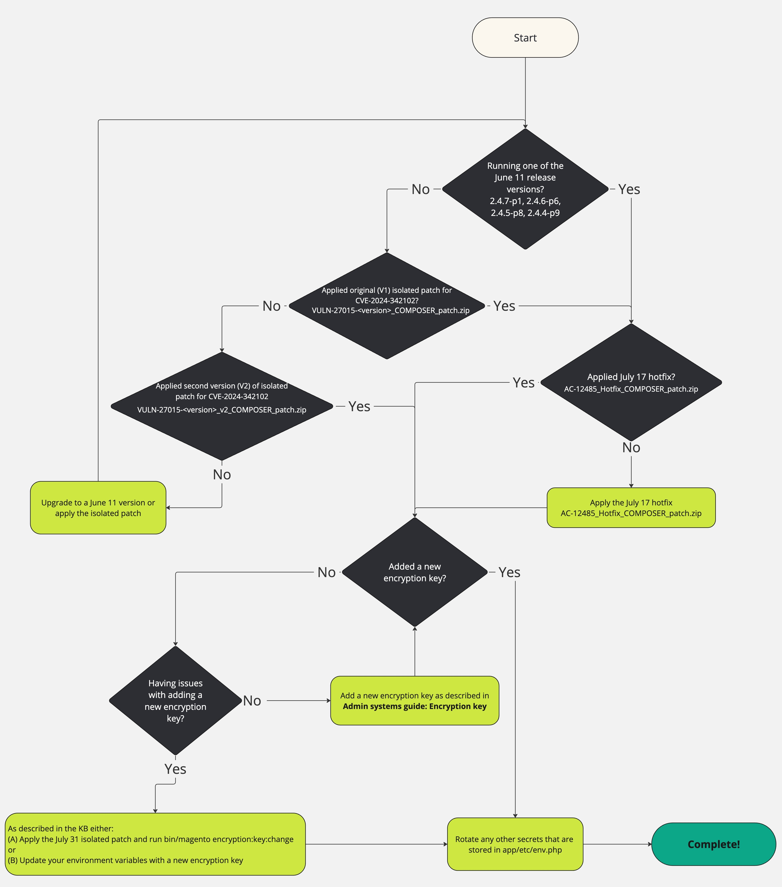

# 疑難排解加密金鑰輪替： [!DNL CVE-2024-34102]

本文旨在協助商戶疑難排解加密金鑰輪換問題，因為他們已遵循[!DNL CVE-2024-34102]上的此[文章](https://experienceleague.adobe.com/en/docs/commerce-knowledge-base/kb/troubleshooting/known-issues-patches-attached/security-update-available-for-adobe-commerce-apsb24-40-revised-to-include-isolated-patch-for-cve-2024-34102)中概述的步驟。

如果您已按照上述文章中的步驟操作，並在輪換加密金鑰時遇到問題，我們提供獨立的修補程式，可協助您解決潛在問題。

為了協助說明先前已溝通及總結的步驟，以防止[!DNL CVE-2024-34102]發生問題，以及下列其他疑難排解，您也可以利用這個流程圖：


{zoomable="yes"}


## 如何套用隔離的修補程式以執行新命令

解壓縮檔案，並參閱我們的支援知識庫中的[如何套用Adobe](https://experienceleague.adobe.com/docs/commerce-knowledge-base/kb/how-to/how-to-apply-a-composer-patch-provided-by-magento.html)提供的撰寫器修補程式，以取得指示。

## 新增加密金鑰而不使用環境變數

預設的應用程式行為是將加密金鑰儲存在`app/etc/env.php`檔案中。

檔案](https://experienceleague.adobe.com/en/docs/commerce-admin/systems/security/encryption-key)中概述的[步驟說明如何使用[!UICONTROL Admin]介面在該檔案中變更此金鑰。

本節提供的步驟和隔離修補程式可讓您輕鬆變更該檔案中的值，並可讓您解決透過[!UICONTROL Admin]介面可能遇到的問題。

不過，管理加密金鑰最簡單且最安全的方法是使用環境變數。 如果您已在使用環境變數，或有興趣使用變數來管理此金鑰，可透過獨立章節說明這些步驟。

## 受影響的產品和版本

雲端上的Adobe Commerce、Adobe Commerce內部部署和Magento Open Source：

* 2.4.7-p1和更舊版本
* 2.4.6-p6和較舊版本
* 2.4.5-p8和更舊版本
* 2.4.4-p9及舊版

## 用於疑難排解加密金鑰輪換詳細資訊的隔離修補程式

根據您的Adobe Commerce/Magento Open Source版本，使用以下附加修補程式：

### 若為2.4.7版、2.4.7-p1版：

* [ac-12589-2-4-7x-composer-patch.zip](assets/ac-12589-2-4-7x-composer-patch.zip)

### 若為版本2.4.6、2.4.6-p1、2.4.6-p2、2.4.6-p3、2.4.6-p4、2.4.6-p5、2.4.6-p6：

* [ac-12589-2-4-6x-composer-patch.zip](assets/ac-12589-2-4-6x-composer-patch.zip)

### 若為版本2.4.5、2.4.5-p1、2.4.5-p2、2.4.5-p3、2.4.5-p4、2.4.5-p5、2.4.5-p6、2.4.5-p7、2.4.5-p8：

* [ac-12589-2.4.5x_COMPOSER_patch.zip](assets/ac-12589-2-4-5x-composer-patch.zip)

### 若為版本2.4.4、2.4.4-p1、2.4.4-p2、2.4.4-p3、2.4.4-p4、2.4.4-p5、2.4.4-p6、2.4.4-p7、2.4.4-p8、2.4.4-p9：

* [ac-12589-2-4-4x-composer-patch.zip](assets/ac-12589-2-4-4x-composer-patch.zip)


安裝隔離修補程式之後，請使用新的[!DNL CLI]命令變更使用中的加密金鑰。

>[!NOTE]
>
>**這個新的[!DNL CLI]命令將在執行時觸發快取清除。**

1. 此新命令應在包含您要更新之金鑰之`app/etc/env.php`檔案的環境上執行。
1. 確認新命令存在：

   ```
   bin/magento list | grep encryption:key:change
   ```

   您應該會看到下列輸出：

   ```
   encryption:key:change Change the encryption key inside the env.php file.
   ```

1. 變更加密金鑰：

   ```
   bin/magento encryption:key:change
   ```

1. 如果您已在生產系統上執行此命令，則不需要進一步的動作。
如果您已在開發系統上執行此變更，則**必須**&#x200B;將此變更匯入您的生產系統，如同您通常部署敏感的組態設定一樣。

## 使用環境變數更新加密金鑰，而非使用隔離的修補程式

作為上述章節的替代方法，這些步驟可讓您新增加密金鑰，同時保留現有的加密資料，即使您目前使用預設值`app/etc/env.php`亦然。
**本節適用於Cloud和Cloud Starter上的Adobe Commerce，但也適用於Adobe Commerce內部部署**，不過變數的確切步驟和位置將取決於您的基礎結構。

### 收集您目前的值

* 如果您已使用環境變數管理金鑰，金鑰可能在[數個可能位置](https://experienceleague.adobe.com/en/docs/commerce-cloud-service/user-guide/configure/env/stage/variables-intro)，但最有可能的是如檔案中所述在[`CRYPT_KEY`](https://experienceleague.adobe.com/en/docs/commerce-cloud-service/user-guide/configure/env/stage/variables-deploy#crypt_key)變數中。
* 如果您未使用變數，則加密金鑰將在`crypt/key`資料金鑰內的`app/etc/env.php`中。

在任何一種情況下，都可能是多行值，並包含多個以`base64`為前置詞的專案。

### 產生新金鑰

加密金鑰是32個位元組的隨機資料，以[!DNL base64]編碼，並加上前置詞`base64`。
若要產生新金鑰：

1. 使用您選擇的工具，產生以[!DNL base64]編碼的32個隨機位元組資料。 例如，使用[!DNL OpenSSL CLI]，您可以執行`openssl rand -base64 32`，但可以使用任何可信賴的密碼隨機產生工具。
1. 將該值加上前置詞`base64`。 例如，如果`openssl`命令輸出&#x200B;*ABC123*，則值會變成： *base64ABC123*

### 製作新值

將產生的值附加至您在上方收集的現有值。 例如，如果現有值為&#x200B;*base64HelloWorld*，則您的新值會變成：<br>

```
base64ABC123
base64HelloWorld
```

### 新增一個新的環境變數

使用[[!UICONTROL Cloud Console]或 [!DNL magento-cloud CLI]](https://experienceleague.adobe.com/en/docs/commerce-cloud-service/user-guide/configure/env/variable-levels)將`env:MAGENTO_DC_CRYPT__KEY` [環境變數](https://experienceleague.adobe.com/en/docs/commerce-cloud-service/user-guide/configure/env/stage/variables-cloud)設定為此新值。

>[!NOTE]
>
>請注意，如果您選擇將變數標示為&#x200B;*敏感*，您可能想要儲存此值的外部備份，因為此值將在所有介面中隱藏，且僅供應用程式看到。

儲存變數後，系統會自動觸發重新部署，進而套用值。

## 安全性更新

Adobe Commerce可用的相關安全性更新：

* [可用於Adobe Commerce的安全性更新 — APSB24-40](https://experienceleague.adobe.com/en/docs/commerce-knowledge-base/kb/troubleshooting/known-issues-patches-attached/security-update-available-for-adobe-commerce-apsb24-40-revised-to-include-isolated-patch-for-cve-2024-34102)
* [Adobe安全性公告([!DNL APSB24-40])](https://helpx.adobe.com/security/products/magento/apsb24-40.html)
