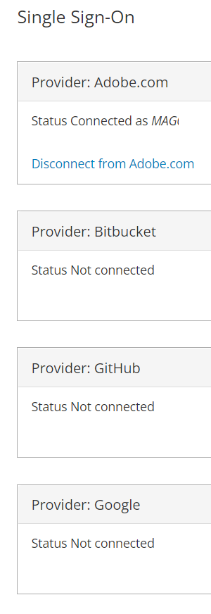

# 無法存取正確的雲端帳戶/專案，或您的帳戶中缺少專案

在帳戶擁有權或相關電子郵件地址變更後，本文提供下列問題的修正：

1. 您無法存取正確的雲端Adobe Commerce專案。
1. 您的帳戶底下沒有顯示任何Adobe Commerce雲端專案 [accounts.magento.cloud/user](https://accounts.magento.cloud/user).
1. 您正在檢視另一個帳戶（即前一個帳戶擁有者）的詳細資料，請前往 [accounts.magento.cloud/user](https://accounts.magento.cloud/user).

## 問題

當擁有權變更或電子郵件地址變更時，您無法存取正確的雲端Adobe Commerce專案。

## 受影響的產品和版本

* 雲端基礎結構上的Adobe Commerce， [所有支援的版本](https://www.adobe.com/content/dam/cc/en/legal/terms/enterprise/pdfs/Adobe-Commerce-Software-Lifecycle-Policy.pdf)

## 原因

此問題通常發生在之前的專案所有者單一登入(SSO)在以下情況下仍與Adobe.com整合：

1. 雲端專案所有權已轉移給您（使用者），而您看到原始專案所有者的帳戶。 按一下這裡以取得 [解決方案](#solution-for-cause-one-and-two).

   或

1. 您（使用者）已移至其他公司，同時變更電子郵件地址和您有權存取的專案。 您會看到先前角色/公司授予您存取權的專案。 按一下這裡以取得 [解決方案](#solution-for-cause-one-and-two).

   或

1. 您已將您在https://account.adobe.com的電子郵件地址變更為另一個電子郵件地址，該地址目前與雲端專案無關。 按一下這裡以取得 [解決方案](#solution-for-cause-three).

## 原因一和二的解決方案 {#solution-for-cause-one-and-two}

當問題是由一和兩個所造成時，的解決方案是中斷與Adobe.com的單一登入整合連線。 請依照下列步驟中斷連線：

1. 從https://accounts.magento.cloud/user中，展開 **[!UICONTROL Single Sign-On]** 區段。 按一下 **[!UICONTROL Disconnect from Adobe.com]**，以中斷連線。

   

1. 按一下 **[!UICONTROL Disconnect]**.

   

1. 登出。
1. 按一下 **[!UICONTROL Adobe.com]** 按鈕。

   

1. 您現在應該能夠檢視正確的帳戶並存取正確的雲端專案。

## 原因三的解決方案 {#solution-for-cause-three}

如果問題是由原因三所造成，請要求專案上現有的超級使用者，將您的新電子郵件地址新增至專案。 如需詳細資訊，請參閱 [管理使用者存取權](https://experienceleague.adobe.com/docs/commerce-cloud-service/user-guide/project/user-access.html).
