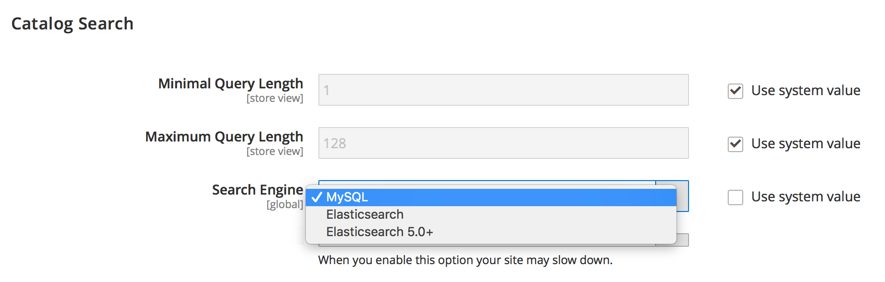
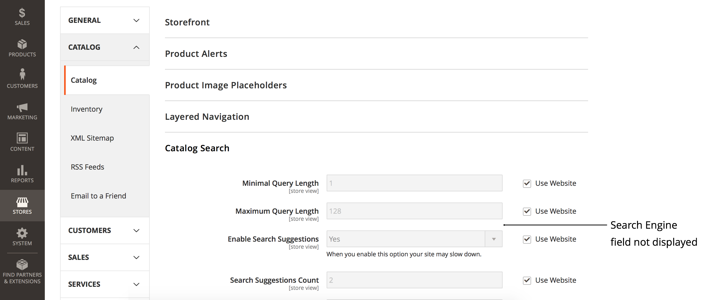

# 無法使用Commerce管理變更搜尋引擎（搜尋引擎功能表無法存取）

>[!WARNING]
>
> [Adobe Commerce 2.4.0中將移除MySQL目錄搜尋引擎](/help/announcements/adobe-commerce-announcements/mysql-catalog-search-engine-will-be-removed-in-magento-2-4-0.md). 您必須先安裝並設定Elasticsearch主機，才能安裝2.4.0版。
> 
> 請參閱：
> [安裝及設定Elasticsearch](https://experienceleague.adobe.com/en/docs/commerce-cloud-service/user-guide/configure/service/elasticsearch).
> [安裝及設定Opensearch](https://experienceleague.adobe.com/en/docs/commerce-cloud-service/user-guide/configure/service/opensearch)
> [安裝和設定即時搜尋](https://experienceleague.adobe.com/en/docs/commerce-merchant-services/live-search/install)

本文提供使用Adobe Commerce管理員變更Commerce搜尋引擎的解決方案，如果 **搜尋引擎** 欄位未顯示或 **使用系統值** 核取方塊呈現灰色而無法存取。

本文章內容：

* [受影響的版本](#affected-versions)
* [使用Commerce管理員變更搜尋引擎（步驟）](#change-search-engine-using-magento-admin-steps)
* [Adobe Commerce內部部署問題](#magento-commerce-on-premise)
* [雲端基礎結構上的Adobe Commerce](#magento-commerce-cloud)

## 受影響的版本

* Adobe Commerce內部部署： 2.4.X
* 雲端基礎結構上的Adobe Commerce：
   * 版本： 2.4.X
   * 入門與Pro計畫架構
* MySQL、Elasticsearch、Opensearch、即時搜尋：所有支援的版本

## 使用管理員變更搜尋引擎（步驟）

1. 登入 **[!UICONTROL Admin]** 作為管理員。
1. 在左側 **[!UICONTROL Admin]** 側欄，按一下 **[!UICONTROL Stores]**.
1. 在 **[!UICONTROL Settings]**，選擇 **[!UICONTROL Configuration]**.
1. 導覽至下方左側的面板 **[!UICONTROL Catalog]，** 並選擇 **[!UICONTROL Catalog]**.
1. 展開 **[!UICONTROL Catalog Search]** 區段。    
1. 前往 **[!UICONTROL Search Engine]** 欄位並移除選取專案 **[!UICONTROL Use system value]** 核取方塊。
1. 按一下 **[!UICONTROL Search Engine]** 功能表並選取其中一個可用選項，如下所示。    
1. 按一下 **[!UICONTROL Save Config]** 在頁面的右上角。

## Adobe Commerce內部部署問題

### 問題1：未顯示搜尋引擎欄位

當您存取 **目錄搜尋** 區段， **搜尋引擎** 功能表完全不顯示。



### 原因：存放區檢視不是預設設定

管理員的「商店檢視」已設為以外的任何值 *預設設定*.

搜尋引擎是在應用程式層級上設定的全域組態，而不是在存放區範圍上。 Adobe Commerce應用程式內的商店不能使用不同的搜尋引擎。

### 解決方案：將存放區檢視設定為預設設定

1. 登入 **[!UICONTROL Admin]** 作為管理員。
1. 在左側 **[!UICONTROL Admin]** 側欄，按一下 **[!UICONTROL Stores]**.
1. 瀏覽至 **[!UICONTROL Settings]** 並選擇 **[!UICONTROL Configuration]**.
1. 在左上角，按一下 **[!UICONTROL Store View]** 選擇器並選擇 **[!UICONTROL *預設設定&#x200B;*]**.
1. 按一下 **[!UICONTROL OK]** 在確認對話方塊中，核准存放區檢視變更。


**相關檔案：** [變更範圍](https://experienceleague.adobe.com/docs/commerce-admin/config/scope-change.html#set-the-scope) 在我們的使用手冊中。

### 問題2：無法取消勾選「使用系統值」

當您存取 **目錄搜尋** 區段， **使用系統值** 核取方塊會呈現灰色，因此您無法從核取方塊中移除選取專案，以便稍後變更搜尋引擎。

### 原因

預設搜尋引擎已設定在 `app/etc/env.php` 或 `app/etc/config.php` 檔案，因此無法使用Admin進行變更。

具有預設搜尋引擎設定的區段範例：

```php
'system'=>
array (
'default'=>
array (
'catalog'=>
array (
'search'=>
array (
'engine'=>'mysql',
),
),
),
),
```

### 解決方案

從移除具有預設搜尋引擎設定的區段 `app/etc/env.php` 或 `app/etc/config.php` 組態檔。

### 開發人員檔案中的相關文章

[Adobe Commerce設定檔](https://experienceleague.adobe.com/docs/commerce-operations/configuration-guide/files/deployment-files.html) Adobe Commerce設定指南中的

## 雲端基礎結構上的Adobe Commerce

由於雲端基礎結構的組織方式，雲端基礎結構上的Adobe Commerce中不提供使用管理員來切換搜尋引擎。

在部署過程中，雲端基礎結構部署指令碼上的Adobe Commerce會檢查是否已在中宣告Elasticsearch `MAGENTO_CLOUD_RELATIONSHIPS` 變數中。 如果宣告，會選取Elasticsearch作為使用中的搜尋引擎並自動設定； [MySQL搜尋引擎](/help/announcements/adobe-commerce-announcements/mysql-catalog-search-engine-will-be-removed-in-magento-2-4-0.md) 在Admin中變得無法存取。 如果未宣告Elasticsearch關係，MySQL會設定為作用中，且Elasticsearch會變成無法存取。

不建議編輯 `app/etc/env.php` 或 `app/etc/config.php` 設定檔案直接在您的雲端環境中；這就是為什麼變更這些檔案以讓Elasticsearch引擎顯示在管理員中（我們在上一節中建議的解決方案）不適用於您的雲端專案。

### 在中繼和生產環境中變更搜尋引擎

將搜尋引擎從MySQL切換為在中繼和生產環境中Elasticsearch之前，請確定您先前已執行 [已提交支援票證](/help/help-center-guide/help-center/magento-help-center-user-guide.md#submit-ticket) 請求在環境中啟用Elasticsearch，並且票證已成功解析。

若要變更測試和生產環境中使用的搜尋引擎，請變更 `SEARCH_CONFIGURATION` 中的環境變數 `.magento.env.yaml` 將變更推送至整合和測試/生產環境，讓變更生效。

如果您要切換至Elasticsearch7，則結果會產生SEARCH\_CONFIGURATION變數 `.magento.env.yaml` 檔案可能如下所示：

```yaml
stage:
  deploy:
   SEARCH_CONFIGURATION:
     engine: elasticsearch7
     elasticsearch_server_hostname: hostname
     elasticsearch_server_port: '12345'
     elasticsearch_index_prefix: magento
     elasticsearch_server_timeout: '15'
```

如果您要切換至 [Opensearch （在2.4.6和更新版本中）](https://experienceleague.adobe.com/en/docs/commerce-knowledge-base/kb/troubleshooting/elasticsearch/search-engine-shown-elasticsearch-despite-open-search) 結果中的SEARCH\_CONFIGURATION變數 `.magento.env.yaml` 檔案可能如下所示：

```yaml
stage:
  deploy:
   SEARCH_CONFIGURATION:
     engine: opensearch
     elasticsearch_server_hostname: hostname
     elasticsearch_server_port: '12345'
     elasticsearch_index_prefix: magento
     elasticsearch_server_timeout: '15'
```

如果您是 [切換到即時搜尋](https://experienceleague.adobe.com/en/docs/commerce-knowledge-base/kb/troubleshooting/miscellaneous/error-opensearch-search-engine-doesnt-exist-falling-back-to-livesearch)，即產生的SEARCH\_CONFIGURATION變數 `.magento.env.yaml` 檔案可能如下所示：

```yaml
stage:
  deploy:
   SEARCH_CONFIGURATION:
     engine: livesearch
```

### 相關檔案

#### 支援知識庫

* [在雲端啟用Elasticsearch](/help/how-to/general/enable-elasticsearch-on-cloud.md)

#### 開發人員檔案

* [設定Elasticsearch服務](https://experienceleague.adobe.com/docs/commerce-cloud-service/user-guide/configure/service/elasticsearch.html)
* [建置和部署](https://experienceleague.adobe.com/docs/commerce-cloud-service/user-guide/configure/env/configure-env-yaml.html) (的相關檔案 `.magento.env.yaml` 組態檔)
* [部署變數](https://experienceleague.adobe.com/docs/commerce-cloud-service/user-guide/configure/env/stage/variables-deploy.html) ([SEARCH\_CONFIGURATION段落](https://experienceleague.adobe.com/docs/commerce-cloud-service/user-guide/configure/env/stage/variables-deploy.html#search_configuration))
* [服務](https://experienceleague.adobe.com/docs/commerce-cloud-service/user-guide/configure/service/services-yaml.html) (的相關檔案 `.magento/services.yaml` 組態檔)
* [即時搜尋](https://experienceleague.adobe.com/en/docs/commerce-merchant-services/live-search/overview)
