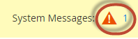

# Cron整備檢查問題

本文提供cron整備問題的解決方案。 以下是cron問題的症狀：

* 即使已正確設定PHP設定`$HTTP_RAW_POST_DATA`，也會顯示錯誤訊息。
* PHP整備檢查不會顯示PHP版本，如下圖所示：
  
* Commerce管理員中會顯示下列錯誤：
  
若要檢視錯誤，您可能需要按一下視窗頂端的&#x200B;**系統訊息**，如下所示：
  

## 檢查您現有的crontab {#check-your-existing-crontab}

本節探討如何檢視cron目前是否正在執行，以及驗證其設定是否正確。

若要確認您的crontab是否已設定：

1. 以或切換至[Magento檔案系統擁有者](https://experienceleague.adobe.com/zh-hant/docs/commerce-operations/installation-guide/prerequisites/file-system/overview)的身份登入您的Commerce伺服器。
1. 檢視下列檔案是否存在： `$ ls -al <magento_root>/var/.setup_cronjob_status`。 如果檔案存在，則cron過去已順利執行。 如果檔案&#x200B;*不存在*，表示您尚未安裝Adobe Commerce或cron未執行。 無論是上述哪一種情況，請繼續進行下一個步驟。
1. 取得有關cron的更多詳細資料。 以具有`root`許可權的使用者身分，輸入下列命令： `$ crontab -u <Magento file system owner name> -l`。 例如，在CentOS `$ crontab -u magento_user -l`上。 如果尚未為使用者設定crontab，則會顯示以下訊息：    `no crontab for magento_user`。 您的crontab會告訴您下列內容：
   * 您正在使用的PHP二進位檔（在某些情況下，您有多個）
   * 您正在執行的Adobe Commerce cron指令碼（尤其是這些指令碼的路徑）
   * cron記錄檔的位置

   請參閱下列其中一個章節，以取得問題的解決方案。

## 解決方案：未設定crontab {#solution-crontab-not-set-up}

若要確認您的cron工作已正確設定，請參閱我們的開發人員檔案中的[設定cron工作](https://experienceleague.adobe.com/zh-hant/docs/commerce-operations/installation-guide/next-steps/configuration)。

## 解決方案：從不正確的PHP二進位檔案執行cron {#solution-cron-running-from-incorrect-php-binary}

如果您的cron作業使用與Web伺服器外掛程式不同的PHP二進位檔，則可能會顯示PHP設定錯誤。 若要解決此問題，請為PHP命令列和PHP Web伺服器外掛程式設定相同的PHP設定。

如需有關PHP設定的詳細資訊，請參閱我們的開發人員檔案中的[必要的PHP設定](https://experienceleague.adobe.com/zh-hant/docs/commerce-operations/installation-guide/prerequisites/php-settings)。

## 解決方案：cron執行時發生錯誤 {#solution-cron-running-with-errors}

嘗試手動執行每個命令，因為命令可能會顯示有用的錯誤訊息。 請參閱我們的開發人員檔案中的[設定cron工作](https://experienceleague.adobe.com/zh-hant/docs/commerce-operations/installation-guide/next-steps/configuration)。

>[!NOTE]
>
>您必須執行cron至少&#x200B;*兩次*，才能執行工作；第一次將工作排入佇列，第二次執行工作。
