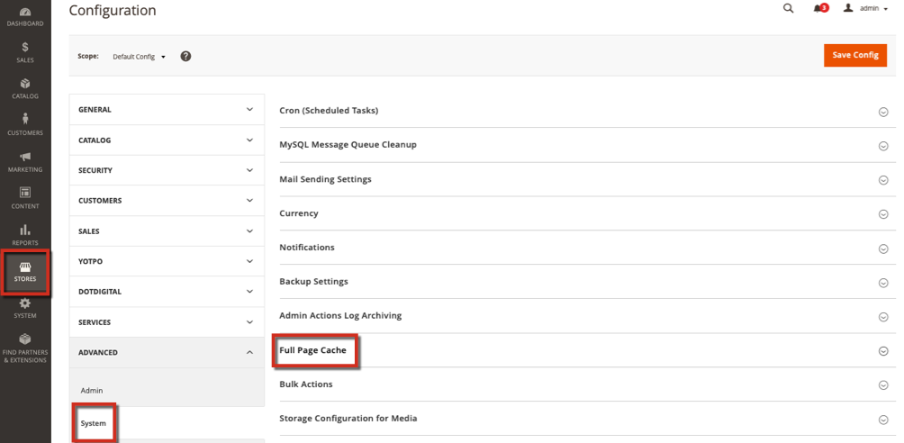

# 清除雲端上的Fastly快取時發生錯誤（未成功處理清除請求）

本文提供使用Fastly清除選項時的修正，且您收到錯誤： *清除要求未成功處理*。 Fastly是一項CDN和快取服務，包含在Adobe Commerce的雲端基礎結構計畫和實作中。 如果您嘗試使用Fastly清除選項，但該選項無法處理，則您的環境中可能有不正確的Fastly認證，或可能會遇到問題。

此資訊可協助您驗證和測試即時網站和來源伺服器的Fastly標題。

## 受影響的版本

* 雲端基礎結構上的Adobe Commerce 2.1.X和更新版本
* Fastly 1.2.27及更高版本

## 問題

快取正在運作，但當您嘗試清除時，您會收到錯誤或無法運作。 錯誤包括：「未成功處理清除請求」。

## 原因

您環境中設定的認證可能不正確，或需要上傳VCL程式碼片段。

## 解析

### 檢查Fastly認證

確認您的環境中是否有正確的Fastly服務ID和API權杖。 如果您在生產環境中使用測試認證，則整個清除可能無法正確處理或處理。

1. 以管理員身分登入您的本機Commerce管理員。
1. 按一下&#x200B;**存放區** >設定> **組態** > **進階** > **系統**，然後展開&#x200B;**完整頁面快取**。    
1. 展開Fastly設定並驗證您環境的Fastly服務ID和API權杖。
1. 如果您修改值，請按一下測試證明資料。

### 檢查VCL代碼片段

如果認證正確，您的VCL可能會發生問題。 若要列出並檢閱每個服務的VCL，請在終端機中輸入下列API呼叫：

```
curl -X GET -s https://api.fastly.com/service/<Service ID>/version/<Editable Version #>/snippet -H "Fastly-Key:FASTLY_API_TOKEN"
```

檢閱VCL清單。 如果您遇到來自Fastly的預設VCL的問題，可以再次上傳或驗證每個[Fastly預設VCL](https://github.com/fastly/fastly-magento2/tree/master/etc/vcl_snippets)的內容。 若要編輯自訂VCL，請參閱Commerce on Cloud Infrastructure指南中的[自訂Fastly VCL片段](https://experienceleague.adobe.com/docs/commerce-cloud-service/user-guide/cdn/custom-vcl-snippets/fastly-vcl-custom-snippets.html)。

## 更多資訊

在我們的開發人員檔案中：

* [關於Fastly](https://experienceleague.adobe.com/docs/commerce-cloud-service/user-guide/cdn/fastly.html)
* [設定Fastly](https://experienceleague.adobe.com/docs/commerce-cloud-service/user-guide/cdn/setup-fastly/fastly-configuration.html)
* [自訂Fastly VCL程式碼片段](https://experienceleague.adobe.com/docs/commerce-cloud-service/user-guide/cdn/custom-vcl-snippets/fastly-vcl-custom-snippets.html)
