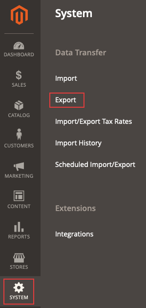

# 匯出的產品.csv檔案不會出現

本文解決在Commerce管理員中將所需的實體型別匯出至.csv檔案時導致檔案未顯示的問題。

## 受影響的產品和版本

* 雲端基礎結構上的Adobe Commerce，所有[支援的版本](https://magento.com/sites/default/files/magento-software-lifecycle-policy.pdf)。

## 問題

<u>要再現的步驟</u>

先決條件： **將秘密金鑰新增至URL**&#x200B;選項設定為&#x200B;*是*。 已在Commerce管理員的&#x200B;**商店** > **設定** > **進階** > **管理員** > **安全性**&#x200B;底下設定此選項。

1. 在管理員中，瀏覽至&#x200B;**系統** > **資料傳輸** > **匯出**。

   

1. 選取
   * **實體型別**：您要匯出的實體
   * **匯出檔案格式**： *CSV*
   * **欄位附件**：保持未勾選。
1. 按一下&#x200B;**繼續**。
1. 顯示下列訊息： *「訊息已新增至佇列，請等候儘快取得您的檔案」*。

<u>預期結果</u>

包含匯出之所需實體型別的.csv檔案會在幾分鐘內顯示在格線中。

<u>實際結果</u>

包含轉存的所需實體型別的.csv檔案在10分鐘或更長時間後不會顯示在格線中。

## 原因

Adobe Commerce應用程式元件2.3.2版中的匯出功能已知問題。

## 解決方案

此問題有兩種可能的解決方案：

* 停用「將秘密金鑰新增至URL」選項。
* 手動執行`bin/magento queue:consumers:start exportProcessor`命令，並選擇性地將其設定為由cron執行。

請參閱以下段落中兩個選項的詳細資料。

### 停用「將秘密金鑰新增至URL」選項

1. 在管理員中，瀏覽至&#x200B;**商店** > **設定** > **進階** > **管理員** > **安全性**。
1. 將&#x200B;**新增秘密金鑰至URL**&#x200B;選項設為&#x200B;*No.*
1. 按一下&#x200B;**儲存設定**。
1. 清除&#x200B;**系統** > **工具** > **快取管理**&#x200B;下的快取，或透過執行    ```bash    bin/magento cache:clean```或Admin。

### 手動執行匯出命令，並選擇性地將其新增為cron作業

若要取得匯出檔案，請執行`bin/magento queue:consumers:start exportProcessor`命令。 執行此動作後，檔案應該會顯示在格線中。


若要選擇性地將處理程式新增為cron工作，您必須將`CRON_CONSUMERS`變數新增到`.magento.env.yaml`檔案。

#### 將程式新增為cron工作（選用）

1. 確認您的cron已設定完畢。 如需詳細資訊，請參閱[設定cron工作](/docs/commerce-cloud-service/user-guide/configure/app/properties/crons-property.html)。
1. 執行以下命令，傳回訊息佇列取用者的清單：     `./bin/magento queue:consumers:list`
1. 將下列專案新增至根應用程式目錄中的`.magento.env.yaml`檔案，並包含您要新增的使用者。 例如，以下是匯出處理所需的消費者：

   ```yaml
   stage:
       deploy:
           CRON_CONSUMERS_RUNNER:
               cron_run: true
               max_messages: 1000
               consumers:
                   - exportProcessor
   ```

   然後推送此更新檔案並重新部署您的環境。 在開發人員檔案中，也請參考[將自訂cron工作新增至您的專案](/docs/commerce-cloud-service/user-guide/configure/app/properties/crons-property.html#add-custom-cron-jobs-to-your-project)。

>[!NOTE]
>
>如果您找不到環境的`.magento.env.yaml`檔案，而且您認為該檔案已被刪除，則必須建立新的`.magento.env.yaml`。 一開始可能是空的，您可以視需要在其中新增資訊。 參考下列文章： [在開發人員檔案中設定部署](/docs/commerce-cloud-service/user-guide/configure/env/configure-env-yaml.html)的環境變數[以及環境變數](/docs/commerce-cloud-service/user-guide/configure/env/stage/variables-intro.html)。

>[!TIP]
>
>[YAML檔案](https://experienceleague.adobe.com/docs/commerce-cloud-service/user-guide/configure/env/configure-env-yaml.html)區分大小寫，不允許使用索引標籤。 請留意在.magento.env.yaml檔案中使用一致的縮排，否則您的設定可能無法如預期運作。 檔案和範例檔案中的範例使用雙空格縮排。 使用ece-tools validate指令檢查您的設定。

>[!NOTE]
>
>在雲端基礎結構上的Adobe Commerce Pro專案上，必須在雲端基礎結構上的Adobe Commerce上啟用[自動cron功能](/docs/commerce-cloud-service/user-guide/configure/app/properties/crons-property.html?lang=en#crontab)，然後才能使用`.magento.app.yaml`將自訂cron工作新增到中繼和生產環境。 如果未啟用此功能，請[建立支援票證](/help/help-center-guide/help-center/magento-help-center-user-guide.md#submit-ticket)，為您新增工作。
