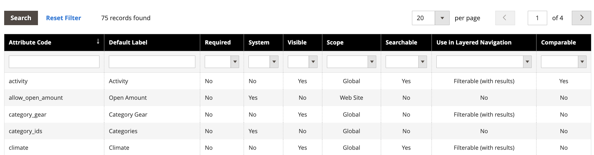

# [!DNL Live Search] Facet未依字母排序

## 受影響的產品和版本

Adobe Commerce 2.4.x和更新版本

## 問題

所有Adobe Commerce店面多面都是使用單選選項依字母順序排序，無論指派給對應屬性的輸入型別為何。

## 因應措施

但是，在某些邊緣案例中，Facet可能無法依照在[[!DNL Live Search] Faceting工作區](https://experienceleague.adobe.com/zh-hant/docs/commerce-merchant-services/live-search/live-search-admin/facets/faceting-workspace)中設定的字母順序排序。

暫行解決方法是在[!UICONTROL Admin]屬性區段中排序產品屬性。

1. 在&#x200B;**[!UICONTROL Admin]**&#x200B;側邊欄上，移至&#x200B;**商店** > *屬性* > **產品**。
1. 從表格中選取屬性。

   

1. 開啟具有您要排序之值的屬性，並選取&#x200B;**屬性資訊** > **屬性**。
1. 在&#x200B;**管理選項**&#x200B;下，您可以排序屬性值。

   
