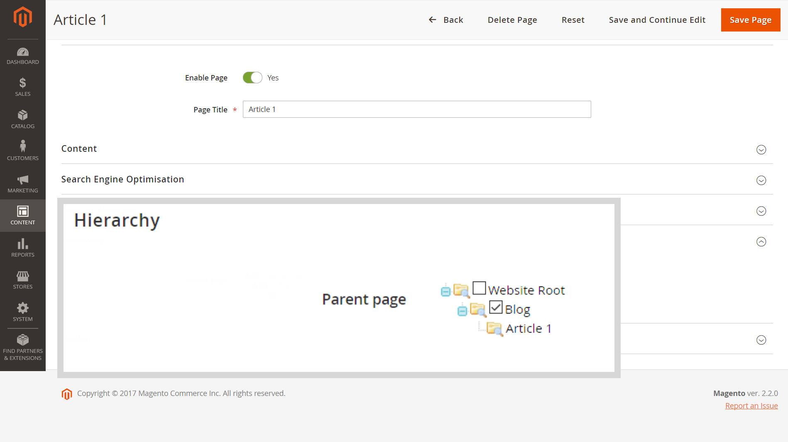

# 主選單（類別）未顯示在已啟用Fastly的子頁面上

本文修正啟用Fastly或Varnish時，主功能表（或使用者指南中的[類別頂端導覽功能表](/docs/commerce-admin/catalog/catalog/navigation/navigation-top.html)）未顯示在子頁面的店面（例如，*部落格/頁面*）的問題。

**原因：**&#x200B;頁面的&#x200B;*URL索引鍵*&#x200B;引數（搜尋引擎最佳化設定）中不允許的`/`字元（斜線）。 當錯誤地指定&#x200B;*URL路徑* （包含整個頁面位置）而非&#x200B;*URL索引鍵*&#x200B;時，通常會新增字元：例如&#x200B;*blog/page\_name*，而不僅僅是&#x200B;*page\_name*。

**解決方案：**&#x200B;移除`/`字元（斜線）；對於&#x200B;*URL索引鍵*&#x200B;引數，僅指定頁面名稱。

## 受影響的版本

* Adobe Commerce內部部署2.X.X
* 雲端基礎結構上的Adobe Commerce 2.X.X
* Fastly或Varnish

## 問題

啟用Fastly或其他清漆型服務時，子頁面的店面不會顯示主功能表（也稱為使用手冊中的[類別頂端導覽功能表](/docs/commerce-admin/catalog/catalog/navigation/navigation-top.html)）。

## 原因

此問題是由新增到&#x200B;*URL索引鍵*&#x200B;引數（搜尋引擎最佳化設定）的不允許`/`字元（斜線）所造成。

當錯誤地指定&#x200B;*URL路徑* （包含整個頁面位置，包括頁面的父資源/目錄）而非&#x200B;*URL索引鍵*&#x200B;時，通常會新增字元：例如&#x200B;*blog/page\_name*，而不僅僅是&#x200B;*page\_name*。

SEO設定的

## 解決方案

針對您商店的所有頁面，從&#x200B;*URL索引鍵*&#x200B;引數中移除`/`字元（斜線）。

換言之，請使用&#x200B;*URL索引鍵*，而非&#x200B;*URL路徑*：僅提及沒有父系資源/目錄的頁面名稱。

### 頁面階層和SEO上的Recommendations

若要設定頁面階層，請使用[編輯頁面]功能表的&#x200B;**階層**&#x200B;區段。

您也可以使用&#x200B;**Content** > **Elements** > **Hierarchy**&#x200B;功能表，以取得更複雜的階層解決方案。

若為產品頁面上的SEO目的，請使用URL重寫（**行銷** > **SEO和搜尋** > **URL重寫**）。

## 使用手冊中的詳細資訊

SEO的&#x200B;*URL索引鍵*&#x200B;引數：

* [搜尋引擎最佳化](/docs/commerce-admin/catalog/categories/create/categories-search-engine-optimization.html)
* [新增頁面](/docs/commerce-admin/content-design/elements/pages/page-add.html)

頁面階層：

* [概觀](/docs/commerce-admin/content-design/elements/pages/page-hierarchy.html)
* [新增節點](/docs/commerce-admin/content-design/elements/pages/page-hierarchy.html#add-a-hierarchy-node)
