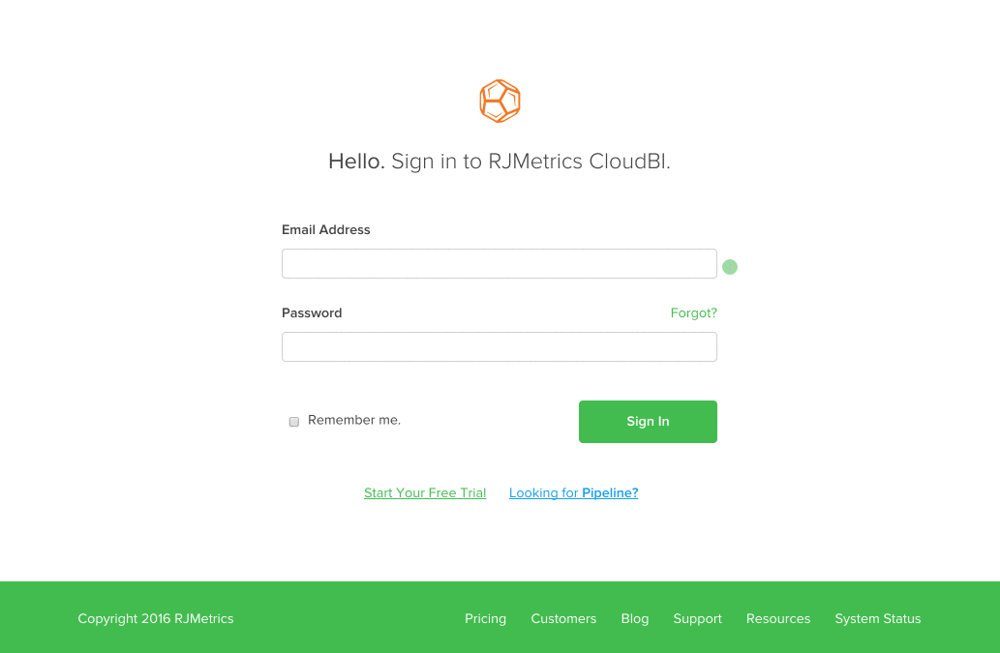

# 疑難排解Adobe Commerce Intelligence帳戶鎖定

<!--
BOB: Is this in TOC?
-->

本文提供Commerce Intelligence帳戶鎖定解決方案。 我們首先需要判斷這是缺陷、暫時故障還是其他問題。 遵循下列步驟將有助於儘快讓您重新進入帳戶。

## 驗證您的電子郵件地址是否正確

仔細檢查您的電子郵件地址，確定您嘗試用來登入的電子郵件地址與現有的Commerce Intelligence帳戶有關。 您可能需要要求帳戶管理員，確認電子郵件地址中沒有任何拼寫錯誤。

在您確認電子郵件地址正確後，請嘗試使用重新登入 [此連結](https://dashboard.rjmetrics.com/v2/session/create#/).

## 嘗試重設您的密碼

如果您已確認您使用正確的電子郵件，請嘗試重設密碼。 您可以使用 **忘記？** 上一節登入頁面上的連結，以觸發密碼重設電子郵件。

如果您一開始沒有看到電子郵件，請務必檢視您的垃圾郵件資料夾。 有時甚至是善意的電子郵件也會被誤認為垃圾郵件。 **請注意，這些電子郵件中的暫時存取連結只適用於一次！**

如果您仍然被鎖定，請確定您的電子郵件地址正確，並且您使用的是重設電子郵件中的正確連結。 建議您嘗試下列操作 **在您請求再次重設並嘗試再次登入之前：**

* 清除瀏覽器的快取、Cookie和儲存的密碼
* 暫時關閉任何廣告封鎖軟體

## 記錄任何錯誤並尋求支援

>[!NOTE]
>
>此步驟並不一定是必要的，但主動完成此步驟可減少因支援要求而往返的時間。

如果您還是無法存取帳戶，建議您檢查錯誤，並將票證提交至我們的支援團隊。 您應如何操作？ 開啟瀏覽器的開發人員工具，並擷取主控台或網站記錄視窗中顯示的任何錯誤的熒幕擷圖。 在以下GIF中，我將開啟Google Chrome適用的開發人員工具：

在上述範例中，我們使用了最常用的方法(**按一下右鍵** > **Inspect**)以開啟主控台。 如果您的瀏覽器沒有此方法，或您需要協助，請針對您使用的網頁瀏覽器，使用下列檔案連結：

<table>
<tbody>
<tr>
<td><a href="https://www.technipages.com/mac-os-x-enable-web-inspector-in-safari">Safari</a></td>
<td><a href="https://developer.mozilla.org/en-US/docs/Tools/Web_Console/Opening_the_Web_Console">Firefox</a></td>
<td><a href="https://developers.google.com/web/tools/chrome-devtools/?hl=en">鉻黃</a></td>
<td><a href="https://www.opera.com/dragonfly/documentation/">Opera</a></td>
<td><a href="https://msdn.microsoft.com/en-us/library/gg589512(v=vs.85).aspx#OpeningTools">Internet Explorer</a></td>
</tr>
</tbody>
</table>

在某些瀏覽器中，開啟開發人員工具可能不會自動顯示主控台，網站的程式碼可能會最先顯示。 如果您遇到這種狀況，請按一下開發人員視窗中的「主控台」選項，並擷取顯示於該處的任何錯誤的熒幕擷取畫面。

透過向我們的支援團隊提交票證 **錯誤熒幕擷取畫面** 以及您的 **Commerce Intelligence帳戶的電子郵件地址**.

## 沒有看到任何錯誤或您剛剛迷路？

別擔心！ 請填寫新的支援票證(請務必加入您的Commerce Intelligence帳戶的電子郵件地址)，我們將會儘快讓您返回帳戶。

## 我們的支援知識庫中的相關主題：

* [新增使用者並設定許可權](https://experienceleague.adobe.com/docs/commerce-business-intelligence/mbi/administrator/user-mgmt/user-management.html)
* [如何更新我的電子郵件地址或密碼？](https://experienceleague.adobe.com/docs/commerce-business-intelligence/mbi/administrator/user-mgmt/create-user.html)
* [如何重設密碼？](https://experienceleague.adobe.com/docs/commerce-business-intelligence/mbi/administrator/user-mgmt/reset-password.html)
