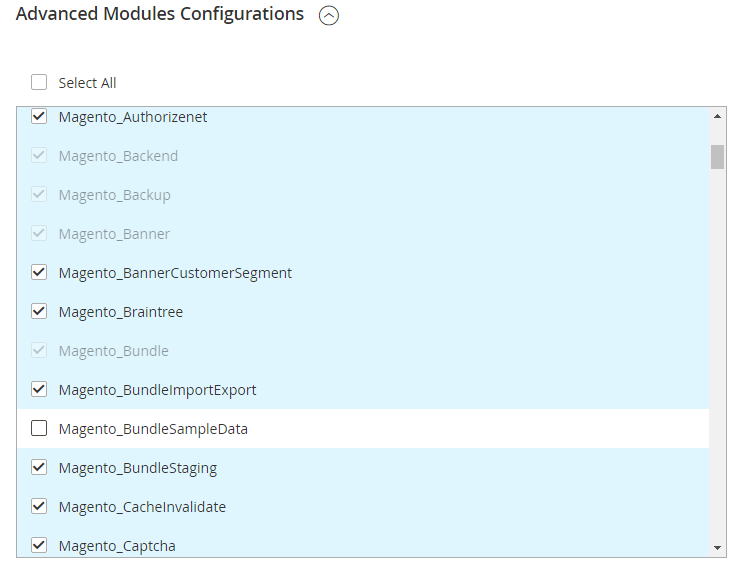

# 未知的模組Magento_BundleSampleData

本文提供安裝Adobe Commerce期間未知模組錯誤的修正。

## 問題 {#details}

安裝期間會顯示類似下列的訊息：

```text
[ERROR] exception 'LogicException' with message 'Unknown module in the requested list: 'Magento_BundleSampleData''
```

## 解決方案 {#solution}

請逐一嘗試下列各項，然後再次嘗試安裝。

1. 執行Web安裝精靈。 模組列於  **進階模組設定**. 若要停用 **Magento\_BundleSampleData** 模組，清除 **Magento\_BundleSampleData** 核取方塊，如下圖所示。

   

1. 清除網頁瀏覽器中的所有瀏覽器歷史記錄和資料。
1. 如果您有Chrome，請清除與網站相關的所有瀏覽器資料。  前往 **設定** > **進階選項** > **隱私權** > **內容設定** > **所有Cookie和網站資料**. 在「網站」欄中，按一下Adobe Commerce伺服器的位址，然後按一下 **全部移除**.
