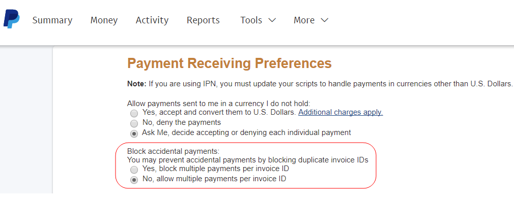

# PayPal閘道已拒絕請求 — 重複發票問題

本文針對PayPal閘道遭拒絕的請求提供修正 — 重複發票問題。

提交付款時，客戶可能會看到重複商業發票的錯誤：

>PayPal閘道已拒絕要求。 已為此InvoiceID付款(\#10412：重複發票)

將具有相同ID的商業發票多次傳送到PayPal時，會發生此問題。

若要解決此問題，請在PayPal的「付款接收偏好設定」中，允許每個商業發票識別碼進行多項付款。 變更後，PayPal會接受不含錯誤訊息的付款，即使是具有重複ID的商業發票亦然。

## 受影響的版本

* Adobe Commerce內部部署，所有版本
* 雲端基礎結構上的Adobe Commerce，所有版本

## 問題

提交付款時，客戶會看到錯誤訊息：

```
... main.CRITICAL: Exception message: PayPal gateway has rejected request. Payment has already been made for this InvoiceID (#10412: Duplicate invoice).
```

PayPal無法處理付款並完成訂單。

## 原因

將具有相同ID的商業發票多次提交至PayPal時，便會顯示錯誤訊息。

跨多個Adobe Commerce網站（甚至跨本機和中繼環境）使用相同的認證時，可能會發生這種情況。 特定情況可能如下：

* 多個商店將商業發票提交至PayPal，並使用相同的商業發票ID
* 新存放區會傳送發票，其識別碼先前已由舊存放區提交

依預設，PayPal不允許處理相同發票兩次。

## 解決方案

變更您的PayPal設定檔，以允許每個發票ID進行多項付款。 您必須透過PayPal進行這些變更。

1. 請在登入您的帳戶 [https://www.paypal.com](https://www.paypal.com/).
1. 按一下 **個人資料** > **設定檔與設定** （右上角）。
1. 前往 **我的銷售工具**.
1. 瀏覽至 **獲得報酬並管理我的風險** > **封鎖付款** 並按一下 **更新**.
1. **銷售偏好設定**，按一下 **付款收貨喜好設定**.
1. 在 **封鎖意外付款**，選擇 **否，允許每個商業發票ID有多個付款**.    
1. 捲動至底部並按一下 **儲存**.

## 更多資訊

* [封鎖意外付款](https://developer.paypal.com/docs/admin/setup-account/#block-accidental-payments) 在PayPal開發人員檔案上。
* 使用手冊中的PayPal付款：
   * [PayPal Express簽出](/docs/commerce-admin/stores-sales/payments/paypal/paypal-express-checkout.html)
   * [其他PayPal解決方案](/docs/commerce-admin/stores-sales/payments/paypal/paypal.html)
* 在我們的開發人員檔案中：
   * [在雲端基礎結構上為Adobe Commerce設定PayPal付款方法](/docs/commerce-cloud-service/user-guide/configure-store/paypal.html)
   * [付款整合](https://developer.adobe.com/commerce/php/development/payments-integrations/)
