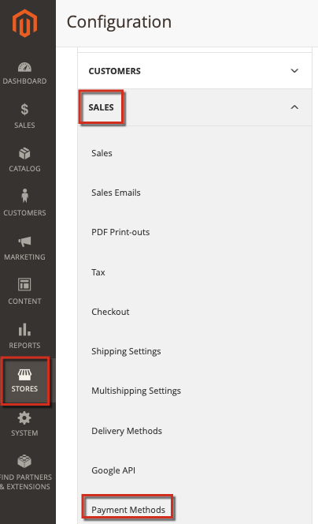

# Adobe Commerce上的PayPal疑難排解

本文提供透過PayPal處理付款相關問題的解決方案，尤其是PayFlow Pro解決方案。 本文中的某些建議似乎顯而易見。 我們要求您嘗試此知識庫中列出的疑難排解選項，並在您輸入的任何票證中包含所有資訊。 Adobe Commerce或PayPal支援工程師會要求您在診斷問題時執行這些步驟。

## 常見問題

PayPal付款的大多數問題都有類似的症狀：在指定付款卡詳細資料並繼續結帳之後，將不會處理付款。 相反地，可能會出現錯誤訊息、付款處理失敗，或甚至空白頁面。

## 驗證您的認證、加密金鑰和授權

可能的問題：帳戶詳細資料（使用者名稱、密碼）列印錯誤、帳戶無效、授權過期或未指定、公開和個人金鑰無效，以及許多其他方面。 若要找出這些問題，您可能還需要檢查您的付款組態設定。

## 在Adobe Commerce和PayPal中套用一致的設定

請確定您已套用相同的設定，並在Commerce管理員和PayPal帳戶設定中啟用相同的功能。

### 範例設定問題

套用PayPal Express Checkout解決方案時，必須在&#x200B;**PayPal管理員** （服務設定>設定>安全性選項）和&#x200B;**Commerce管理員** （**商店** >設定> **銷售** > **付款方式** ...）中拒絕以AVS/CSC回應為依據的交易。

如需詳細資訊，請參閱使用手冊中的檔案： [PayPal](https://www.paypalobjects.com/en_US/vhelp/paypalmanager_help/setup.htm)和[Adobe Commerce](/docs/commerce-admin/stores-sales/payments/paypal/paypal-express-checkout.html)。

## 允許參考交易

如果您的PayPal付款方式涉及附帳單協定和參考交易的API，請確定已在您的設定中正確啟用和設定它們。

### 其他疑難排解

請參閱下列文章：

* [PayPal閘道已拒絕要求 — 我們的支援知識庫中有重複的發票問題](/help/troubleshooting/payments/paypal-gateway-rejected-request-duplicate-invoice-issue.md)。
* [變更支援知識庫中新商店實體](/help/how-to/general/change-increment-id-for-a-db-entity-order-invoice-credit-memo-etc-on-particular-store.md)的遞增識別碼。

## 聯絡支援以收集進階付款記錄

為了疑難排解複雜的付款問題，Adobe Commerce支援團隊可能會要求您套用專用的修補程式，以啟用進階付款記錄。 在此情況下，您的步驟應該如下：

[提交支援票證](/help/help-center-guide/help-center/magento-help-center-user-guide.md#submit-ticket)，其詳細資料如下：

* 儘可能多地指定您的問題。
* 列出您嘗試從本文、知識庫和其他資源執行的步驟。 包含所有結果。
* 請求進階付款記錄修補程式（參考編號MDVA-4352）及套用修補程式的指示。

如果您收到「進階付款記錄」修正程式：

* 套用修補程式。
* 收集記錄檔並將它們附加至您的[支援票證](/help/help-center-guide/help-center/magento-help-center-user-guide.md#submit-ticket)。
* 等待Adobe Commerce支援團隊提出進一步建議。
