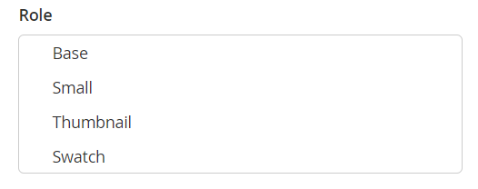

# 儘管具有「產品編輯」影像角色，仍不會顯示產品影像

本文提供即使在「產品編輯」頁面上設定了影像角色，但店面仍無顯示產品影像時適用的修正。

**原因：** 在具有多個商店的Adobe Commerce執行個體上，某些產品影像可能會 `no_selection` 影像角色屬性的值 `image`， `small_image`， `thumbnail`， `swatch`. 此類 `no_selection` 當產品影像角色設定在全域、所有存放區範圍上，而非特定存放區的範圍(換言之， **所有商店檢視** 而不是特定 **存放區檢視**)。 若要瞭解您的情況，請從以下位置執行SQL指令碼： **原因** 一節。

**解決方案：** 使用刪除列 `no_selection` 使用下列「解決方案」一節中的SQL指令碼，取得這類影像的值。

## 受影響的版本

* Adobe Commerce內部部署2.X.X
* 雲端基礎結構上的Adobe Commerce 2.X.X

## 問題

雖然已在管理員面板的「產品」頁面上正確設定影像角色（基底、小圖、縮圖、色票），但產品影像可能不會顯示在您的店面上。

當您使用檢查產品頁面時 **存放區檢視** 設為 **所有商店檢視**，則圖片上的角色已設定 **影像詳細資料** 畫面。


不過，在店面不會顯示影像；當您檢查特定商店層級的「產品」頁面(切換 **存放區檢視**)，影像已存在，但未設定角色。



## 原因

在多商店Adobe Commerce執行個體上（有多個商店），某些產品影像可能會 `no_selection` 屬性值 `image`， `small_image`， `thumbnail`， `swatch` （這些屬性對應至影像角色）。 此類 `no_selection` 當產品影像角色設定在全域、所有存放區範圍上，而非特定存放區的範圍(換言之， **所有商店檢視** 而不是特定 **存放區檢視**)。

技術上：開啟 `store_id=0` (保留Adobe Commerce執行個體上所有商店的全域設定)，可能會設定產品影像角色：這表示屬性 `image`， `small_image`， `thumbnail`， `swatch` 具有有效值（影像路徑）。 同時，於 `store_id=1` （這是特定存放區表示），這些屬性的值為 `no_selection`.

### 如何確認您的問題

執行此SQL查詢：

```sql
SELECT `cpev_s`.*, `cpev_0`.`value` AS `store_value` FROM `catalog_product_entity_varchar` `cpev_s` JOIN `eav_attribute` `ea` ON `cpev_s`.`attribute_id` = `ea`.`attribute_id` LEFT JOIN `catalog_product_entity_varchar` `cpev_0` ON `cpev_0`.`row_id` = `cpev_s`.`row_id` AND `cpev_0`.`attribute_id` = `cpev_s`.`attribute_id` AND `cpev_0`.`store_id` = 0 WHERE `cpev_s`.`value` = 'no_selection' AND `ea`.`attribute_code` IN ('image', 'small_image', 'thumbnail') AND `cpev_s`.`store_id` > 0 AND `cpev_s`.`value` != `cpev_0`.`value` AND `cpev_s`.`value` = 'no_selection';
```

如果查詢傳回如下結果，表示您正在處理本文記錄的問題：

```sql
+----------+--------------+----------+--------+--------------+----------------------------+
| value_id | attribute_id | store_id | row_id | value        | store_value                |
+----------+--------------+----------+--------+--------------+----------------------------+
|    67722 |           87 |        1 |    481 | no_selection | /3/5/355sss1_main.jpg      |
|    67723 |           88 |        1 |    481 | no_selection | /3/5/355sss1_main.jpg      |
|    67724 |           89 |        1 |    481 | no_selection | /3/5/355sss1_main.jpg      |
|    67814 |           87 |        1 |    503 | no_selection | /s/k/skb2031_main.jpg      |
|     6769 |           87 |        2 |    503 | no_selection | /s/k/skb2031_main.jpg      |
|    67815 |           88 |        1 |    503 | no_selection | /s/k/skb2031_main.jpg      |
|     6770 |           88 |        2 |    503 | no_selection | /s/k/skb2031_main.jpg      |
|    67816 |           89 |        1 |    503 | no_selection | /s/k/skb2031_main.jpg      |
|     6771 |           89 |        2 |    503 | no_selection | /s/k/skb2031_main.jpg      |
+----------+--------------+----------+--------+--------------+----------------------------+
9 rows in set (0.06 sec)
```

### 為什麼會發生這個情況？

如果Adobe Commerce應用程式有多個存放區，它可能不會在特定存放區和全域存放區設定之間同步資料。

值 `store_id=1` 具有比預設（全域）存放區更高的優先順序(`store_id=0`)。 因此，應用程式可能會忽略全域影像設定，並使用存放區範圍設定(`no_selection` （適用於影像角色屬性）。

## 解決方案 {#solution}

刪除屬性，使用 `no_selection` 使用此SQL指令碼的值：

```
DELETE `cpev_s`.* FROM `catalog_product_entity_varchar` `cpev_s` JOIN `eav_attribute` `ea` ON `cpev_s`.`attribute_id` = `ea`.`attribute_id` LEFT JOIN `catalog_product_entity_varchar` `cpev_0` ON `cpev_0`.`row_id` = `cpev_s`.`row_id` AND `cpev_0`.`attribute_id` = `cpev_s`.`attribute_id` AND `cpev_0`.`store_id` = 0 WHERE `cpev_s`.`value` = 'no_selection' AND `ea`.`attribute_code` IN ('image', 'small_image', 'thumbnail') AND `cpev_s`.`store_id` > 0 AND `cpev_s`.`value` != `cpev_0`.`value` AND `cpev_s`.`value` = 'no_selection';
```

移除這些屬性後，會設定特定存放區的角色，且影像會顯示在存放區正面。

## 其他詳細資料

如果您的Adobe Commerce執行個體中啟用了完整頁面快取，將無法立即檢視修正結果。

若要顯示變更，請使用 **快取管理** 管理面板的功能表。

## 更多資訊

### 存放區和範圍

[儲存和儲存範圍](/docs/commerce-admin/stores-sales/site-store/stores.html) 在我們的使用手冊中

### 影像

[上傳產品影像](/docs/commerce-admin/catalog/products/digital-assets/product-image.html#upload-an-image) 在我們的使用手冊中

### 快取

* [快取管理](/docs/commerce-admin/systems/tools/cache-management.html) （位於我們的使用者管理員系統指南中）。
* [管理快取](/docs/commerce-operations/configuration-guide/cli/manage-cache.html) 在我們的開發人員檔案中